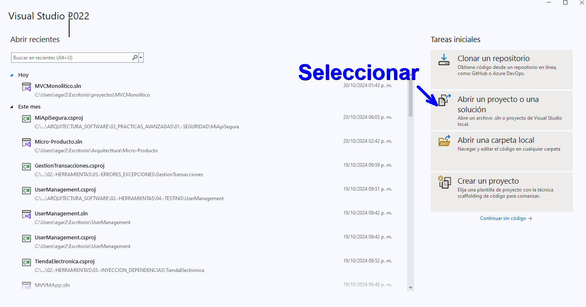
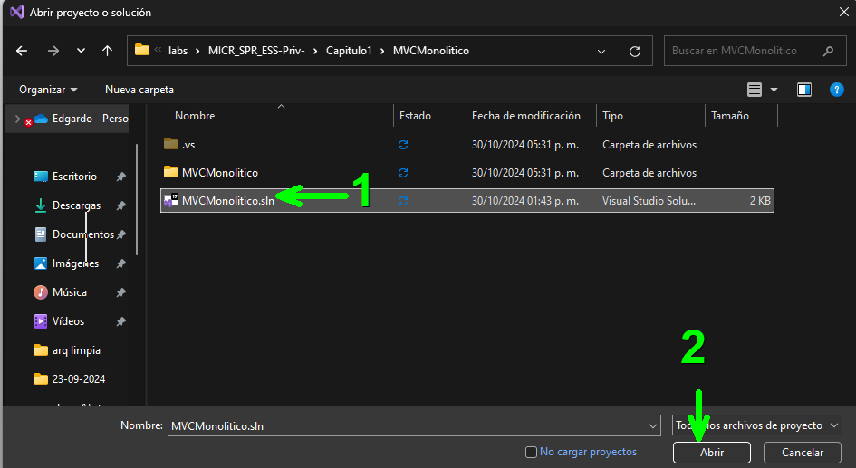
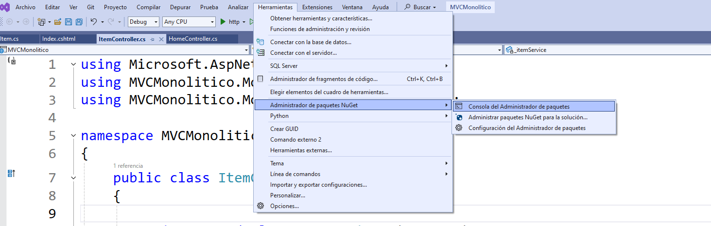
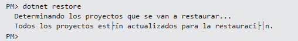
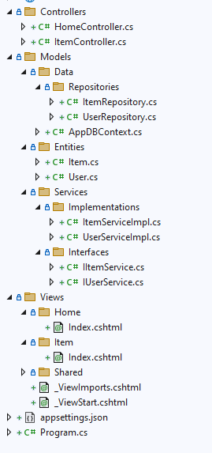
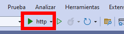
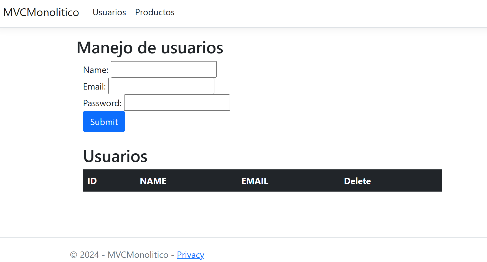

# 1. Sistema Monolítico .net Core 8

En este laboratorio se implementa una aplicación monolítica de .net core usando Visual Studio 2022


## Objetivos
- Comprender la estructura de un sistema monolítico
- Iniciar y probar un sistema monolítico
- Analizar los componentes del sistema
- Entender MVC 

---
<!--Este fragmento es la barra de 
navegación-->

<div style="width: 400px;">
        <table width="50%">
            <tr>
                <td style="text-align: center;">
                    <a href=""></a>
                    <br>anterior
                </td>
                <td style="text-align: center;">
                   <a href="../README.md">Lista Laboratorios</a>
                </td>
<td style="text-align: center;">
                    <a href="../Capitulo2/README.md"></a>
                    <br>siguiente
                </td>
            </tr>
        </table>
</div>

---

## Diagrama 

Se espera que el alumno analice la siguiente estructura de aplicación. 


## Instrucciones 

1. Descargar la aplicación que se encuentra en la carpeta **[Capitulo1](../Capitulo1)** con el nombre **MVCMonolitico**

2. Abrir Visual Studio 2022 
<br>



3. Abrir la solución

<br>



4.  Abrir la consola de administración de paquetes nuget **Herramientas** -> **Administrador de paquetes nuget**->**Consola de administrador de paquetes**
<br>



5. En la terminal ejecutar el comando 

```bash
donet restore
```




6. Analizar las clases y el código que esta en el proyecto



7. Iniciar la aplicación



> Es posible que la aplicación tarde en iniciar la primera vez.


# Resultado esperado

Al iniciar la aplicación usted debería de observar algo similar a la pantalla. 



> Insertar datos en la aplicación y observar el funcionamiento. 

> Tome nota de la arquitectura usada, ya que en los microservicios la organización de código es similar. 