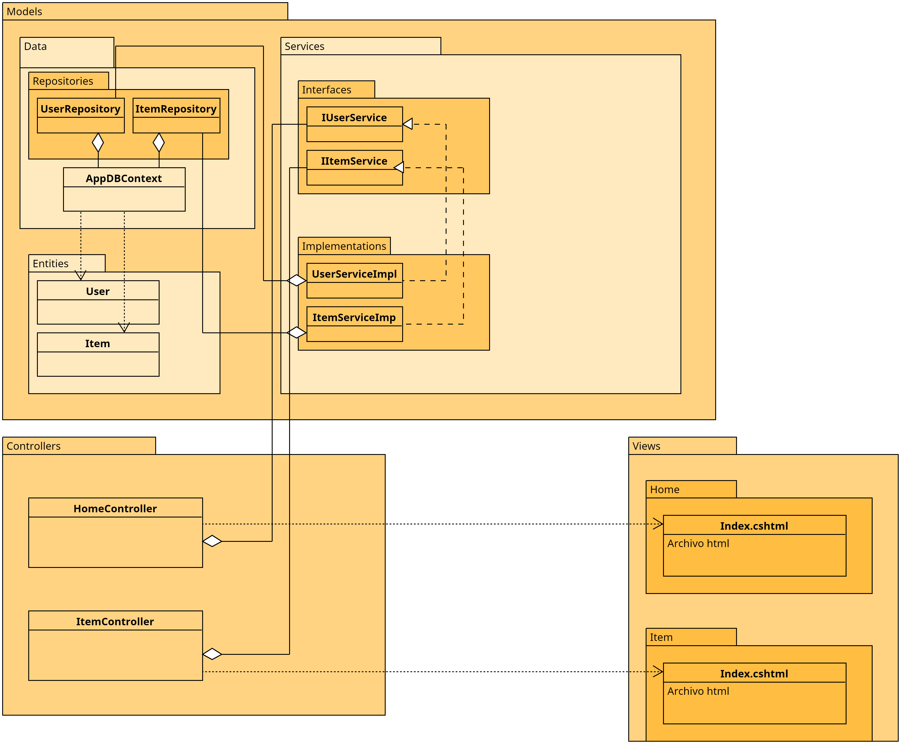

# Práctica 1. Sistema Monolítico .net Core 8

## Descripción:

En este laboratorio se implementa una aplicación monolítica de .net core usando Visual Studio 2022.

## Objetivos:

Al finalizar la práctica, serás capaz de:

- Comprender la estructura de un sistema monolítico. <br>
- Iniciar y probar un sistema monolítico. <br>
- Analizar los componentes del sistema. <br>
- Entender MVC.

---
<!--Este fragmento es la barra de 
navegación-->

<div style="width: 400px;">
        <table width="50%">
            <tr>
                <td style="text-align: center;">
                    <a href=""></a>
                    <br>Anterior
                </td>
                <td style="text-align: center;">
                   <a href="../README.md">Lista de laboratorios</a>
                </td>
<td style="text-align: center;">
                    <a href="../Capitulo2/README.md"></a>
                    <br>Siguiente
                </td>
            </tr>
        </table>
</div>

---

## Objetivo visual: 

Se espera que analices la siguiente estructura de aplicación: 



## Instrucciones:

1. Descargar la aplicación que se encuentra en la carpeta **[Capitulo1](../Capitulo1)** con el nombre **MVCMonolitico**.

2. Abre Visual Studio 2022. <br>


3. Abre la solución. <br>


4.  Abre la consola de administración de paquetes NuGet **Herramientas** > **Administrador de paquetes NuGet** > **Consola de administrador de paquetes**. <br>


5. En la terminal, ejecuta el siguiente comando:

```bash
donet restore
```


6. Analiza las clases y el código que está en el proyecto.


7. Inicia la aplicación.


> Es posible que la aplicación tarde en iniciar la primera vez.

# Resultado esperado:

Al iniciar la aplicación, debes de observar algo similar a la pantalla:


> Inserta datos en la aplicación y observa el funcionamiento. 

> Toma nota de la arquitectura usada, ya que en los microservicios la organización de código es similar. 
