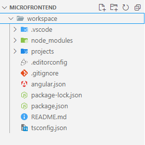

# 10. Microfrontend con Angular 18
En este laboratorio se explora las bases de los microfrontends usando 
**native-federation** en angular 18

## Objetivos
- Instalar y configurar native federation
- Crear un microfrontend
- Comunicar microfrontend con shell
- Interactuar con microfrontends con explorador web

---

<div style="width: 400px;">
        <table width="50%">
            <tr>
                <td style="text-align: center;">
                    <a href="../Capitulo9/README.md"></a>
                    <br>anterior
                </td>
                <td style="text-align: center;">
                   <a href="../README.md">Lista Laboratorios</a>
                </td>
<td style="text-align: center;">
                    <a href="../Capitulo11/README.md"></a>
                    <br>siguiente
                </td>
            </tr>
        </table>
</div>

---


## Diagrama


> **IMPORTANTE**: Para realizar este laboratorio se necesita la versión **node 20.18.0** y la versión **angular cli 18.2.5**. 

## Instrucciones
1. Abrir una terminal de windows

2. Dirigirse en el escritorio y crear una carpeta la llamaremos **microfrontend**
 
    ```bash
    mkdir microfrontend
    ```
    

3. Entrar a la carpeta **microfrontend** desde la terminal

4. Creamos un **workspace** de angular con el siguiente comando:

    ```bash
    ng new workspace --create-application=false 
    ```
    

5. Entrar al workspace generado, **cd workspace**

6. Generar 3 proyectos dentro del workspace

    > **IMPORTANTE**: Al generar los 3 proyectos, por cada proyecto me pregunta si quiero activar el **SSR**, en los 3 casos le diremos que no

    ```bash
    ng generate application shell --style=css
    ```

    ```bash
    ng generate application inicio --style=css
    ```

    ```bash
    ng generate application alumno --style=css
    ```

7. Instalamnos **Native Federation** (seguimos en el workspace desde la terminal)

    ```bash
    npm i -D @angular-architects/native-federation
    ```


8. Configuramos el proyecto **host**

```bash
ng g @angular-architects/native-federation:init --project shell --port 4200 --type dynamic-host
```


9. Configuramos los proyectos remotos **inicio** y **alumno**

```bash
ng g @angular-architects/native-federation:init --project inicio --port 4201 --type remote
```

```bash
ng g @angular-architects/native-federation:init --project alumno --port 4202 --type remote
```


10. Abrir la carpeta microfrontend en **Visual Studio Code**



11. Abrir el archivo **workspace**->**projects**->**shell**->**public**->**federation.manifest.json** y sustituir su contenido con lo siguiente:

```json
{
	"inicio": "http://localhost:4201/remoteEntry.json",
	"alumno": "http://localhost:4202/remoteEntry.json"
}
```

12. Abrir el archivo **workspace**->**projects**->**shell**->**src**->**main.ts** y sustituir su contenido:

```typescript
import { initFederation } from '@angular-architects/native-federation';

initFederation('federation.manifest.json')
  .catch(err => console.error(err))
  .then(_ => import('./bootstrap'))
  .catch(err => console.error(err));
```

13. Abrir el archivo **workspace**->**projects**->**shell**->**src**->**app**->**app.routes.ts**
y añadir las siguientes rutas: 

```typescript
import { loadRemoteModule } from '@angular-architects/native-federation';
import { Routes } from '@angular/router';

export const routes: Routes = [
    {
        path:'',
        loadComponent:()=>
            loadRemoteModule('inicio','./Component').then((m)=>m.AppComponent)

    },
    {
        path:'alumno',
        loadComponent:()=>
            loadRemoteModule('alumno','./Component').then((m)=>m.AppComponent)
    }
];
```

14. Abrir el siguiente archivo **workspace**->**projects**->**shell**->**src**->**app**->**app.component.ts** y añadir en la sección de importaciónes **RouterLink**

```typescript
import { Component } from '@angular/core';
import { RouterLink, RouterOutlet } from '@angular/router';

@Component({
  selector: 'app-root',
  standalone: true,
  imports: [RouterOutlet, RouterLink], //aqui se agrega
  templateUrl: './app.component.html',
  styleUrl: './app.component.css'
})
export class AppComponent {
  title = 'shell';
}
```

15. Añadir boostrap en el siguiente archivo: **workspace**->**projects**->**shell**->**src**->**index.html**

```html
<!doctype html>
<html lang="en">
<head>
  <meta charset="utf-8">
  <title>Shell</title>
  <base href="/">
  <meta name="viewport" content="width=device-width, initial-scale=1">
  <link rel="icon" type="image/x-icon" href="favicon.ico">
  <!--link bootstrap-->
  <link href="https://cdn.jsdelivr.net/npm/bootstrap@5.3.3/dist/css/bootstrap.min.css" rel="stylesheet" integrity="sha384-QWTKZyjpPEjISv5WaRU9OFeRpok6YctnYmDr5pNlyT2bRjXh0JMhjY6hW+ALEwIH" crossorigin="anonymous">
</head>
<body>
  <app-root></app-root>

  <!--script bootstrap-->
  <script src="https://cdn.jsdelivr.net/npm/bootstrap@5.3.3/dist/js/bootstrap.bundle.min.js" integrity="sha384-YvpcrYf0tY3lHB60NNkmXc5s9fDVZLESaAA55NDzOxhy9GkcIdslK1eN7N6jIeHz" crossorigin="anonymous"></script>
</body>
</html>
```

16. Abrir el archivo **workspace**->**projects**->**shell**->**src**->**app**->**app.component.html** y modificarlo con el siguiente código:

```html
<nav class="navbar bg-primary navbar-expand-lg">
  <div class="container-fluid">
    <a class="navbar-brand">Banco</a>
    <button class="navbar-toggler" type="button" data-bs-toggle="collapse" data-bs-target="#navbarNav" aria-controls="navbarNav" aria-expanded="false" aria-label="Toggle navigation">
      <span class="navbar-toggler-icon"></span>
    </button>
    <div class="collapse navbar-collapse" id="navbarNav">
    <ul class="navbar-nav">
      <li class="nav-item"><a class="nav-link" style="color: aliceblue;" routerLink="/">Inicio</a></li>
      <li class="nav-item"><a class="nav-link" style="color:aliceblue;" routerLink="/alumno">Alumno</a></li>
    </ul>
    </div>
  </div>
</nav>

<router-outlet></router-outlet>
```

17. Abrir el archivo **workspace**->**projects**->**inicio**->**src**->**app**->**app.component.html**  y añadir el siguiente código: 

```html
<div class="container-fluid py-5">
  <h1 class="display-5 fw-bold">Aplicación Inicio</h1>
  <p class="col-md-8 fs-4">Esta applicación se encuentra ejecutandose en el puerto 42001, con el uso del shell podemos invocar a esta aplicación</p>
  <p class="col-md-8 fs-4">Es interesante el futuro de los microservicios en el mundo del frontend a pesar que aún le falta camino que recorrer</p>
</div>
```

18. Abrir el archivo **workspace**->**projects**->**alumno**->**src**->**app**->**app.component.html** modificarlo con el siguiente contenido:

```html
<div class="container-fluid py-5" style="width: 600px;">
   <h1 class="display-5">Información alumno</h1>
   <table class="table">
    <thead>
      <tr>
        <th>Nombre</th>
        <th>Puesto</th>
        <th>Email</th>
      </tr>
    </thead>
    <tbody>
      <tr>
         <td>Edgardo</td>
         <td>Developer</td>
         <td>edgardo.velasco&#64;netec.com</td>
      </tr>
    </tbody>
   </table>
</div>
```

19. Abrir 3 terminales y navegar hasta la carpeta **workspace** en las 3 y en cada una iniciar cada proyecto

```bash
ng serve shell
```
```bash
ng serve inicio
```
```bash
ng serve alumno
```

## Resultado Esperado


