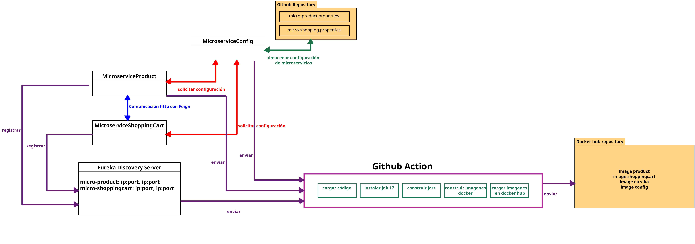

# Práctica 11. Proyecto final 
La empresa Netec requiere una implementación en microservicios para controlar el sistema de articulos y el carrito de compras.
Para netec es importante el buen diseño de las  aplicaciones, porque se piensa agregar más en un futuro. Y también la carga de trabajo es variable.

---

        <table width="50%">
            <tr>
                <td style="text-align: center;">
                    
                     anterior
                </td>
                <td style="text-align: center;">
                   <a href="../README.md">Lista Laboratorios</a>
                </td>
<td style="text-align: center;">
                    
                     siguiente
                </td>
            </tr>
        </table>

---

## Características de microservicio articulo.
El microservicio articulos debe permitir:

- El CRUD de la entidad.
- La entidad articulo debería tener los siguientes atributos:
    - **id:long**
    - **name:String**
    - **description:String**
    - **price:double**

## Características del microservicio Carrito.

Por cuestiones de seguridad debe protegerse este microservicio usando **Openid Connect**.

- La entidad Carrito debe de tener los siguientes elementos:
    - **articulos:List**
- No es necesario guardarlo en una base de datos el Carrito de compras.
- El microservicio debe conectarse al microservicio articulo cuando inserte un articulo. 
- Debe tener una función que retorne la suma total del costo de los productos. 

## Características de implementación.

- La configuración de los microservicios debe estar externalizada usando **Spring Cloud Config**.

- Usar el servicio de descubrimiento eureka, para el registro de los microservicios. 

- Generar las imágenes de los microservicios usando **Github Actions**.

- Guardar todos los entregables en una carpeta **entregables** dentro del repositorio. 

## Diagrama Propuesto

## Entregable

- Se debe enviar un correo a **edgardo.velasco@netec.com** con el URL del repositorio.
> **IMPORTANTE**: **para la revisión, el repositorio debe estar público, de no ser así, no se calificara el proyecto.**

- Dentro del repositorio debes de crear una carpeta llamada **entregables** con 4 carpetas, las cuales deberán llamarse: **producto**, **carrito**, **config** y **eureka**.

    - Añadir en la carpeta **producto** las siguientes capturas:
        - 4 capturas de pantalla 1 por cada método del **CRUD**. 
    
    - Añadir en la carpeta **carrito** las siguientes capturas:
        - 1 captura de la función **ver todos los productos**.
        - 1 captura de la función **insertar producto**.
        - 1 captura de la función **total productos**.
    
    - Añadir en la carpeta **config** las siguientes capturas:
        - 1 captura obteniendo la configuración de **micro-product**.
        - 1 captura obteniendo la configuración de **micro-shoppingcart**.
    
    - Añadir en la carpeta **eureka** las siguientes capturas:
        - 1 captura del **dashboard eureka** donde se muestren ambos microservicios registrados.

> **IMPORTANTE**: Si falta alguna de las capturas o proyectos afecta en tu calificación final. 
