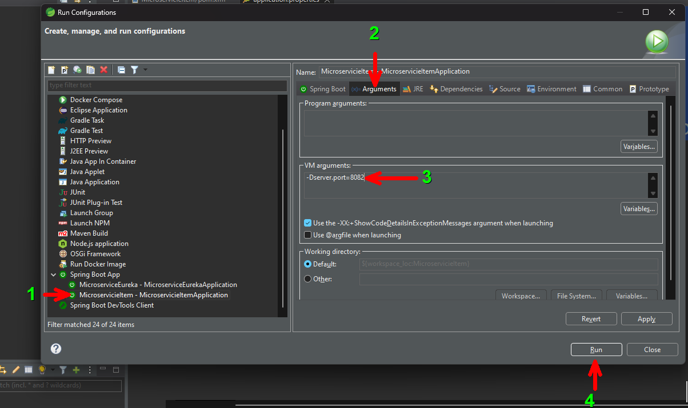

# 2. Servicio de Descubrimiento con microservicios
En este laboratorio se implementa un microservicio escalado horizontalmente con el servicio de descubrimiento Eureka


## Objetivos
- Comprender la estructura de un microservicio
- Implementar el servicio de descubrimiento Eureka
- Registrar microservicio
- Escalado horizontal del microservicio

---
<div style="width: 400px;">
        <table width="50%">
            <tr>
                <td style="text-align: center;">
                    <a href="../Capitulo1/README.md"></a>
                    <br>anterior
                </td>
                <td style="text-align: center;">
                   <a href="../README.md">Lista Laboratorios</a>
                </td>
<td style="text-align: center;">
                    <a href="../Capitulo3/README.md"></a>
                    <br>siguiente
                </td>
            </tr>
        </table>
</div>

---

## Diagrama


<br>


## Instrucciones
### Configuración de micro-item
1. Descargar el proyecto de Spring Boot de la carpeta [Capitulo2](../Capitulo2/) llamado **MicroserviceItem**

2. Abrir el proyecto en Spring Tool Suite **File**->**Import**->**Existing Maven projects**

3. Analizar la estructura del proyecto


4. Iniciar el proyecto <br>
**Click Derecho al Proyecto**-> **Run As**->**Spring Boot App**

5. Iniciar un cliente para API's **Postman** ó **Insomnia**

6. Probar los siguientes endpoints
    - ## **GET** (*obtiene todos los productos*): http://localhost:8081/item

    

    <br><br>

    - ## **POST** (*inserta un nuevo producto*): http://localhost:8081/item

    <br>

    **Body format**

    ```json
    {
	"name":"jamon",
	"brand":"fud",
	"amount":500,
	"description":"jamón de pavo"
    }
    ```
    

    <br><br>

    - ## **DELETE** (*eliminar un producto por id*): http://localhost:8081/item?id=2

    

    <br><br>

    - ## **PUT** (*actualiza un producto*): http://localhost:8081/item

    **Body format**

    ```json
    {
	"id":3,
	"name":"jamon",
	"brand":"fud",
	"amount":8000,
	"description":"jamón de pavo"
    }
    ```

    


## Creación de Microservice Eureka 
> Este microservicio nos permitirá llevar el registro de nuestros microservicios. 
 1. Abrir Spring Tool Suite
 2. Crear un proyecto nuevo **File** -> **New** -> **Spring Starter Project**

 3. Configuración inicial
    - **Name**: MicroserviceEureka
    - **Type**: Maven
    - **Packaging**: Jar
    - **Language**: Java
    - **Java Versión**: 17
    - **Group**: com.bancolombia
    - **Version**: 1.0.0
    - **Description**: my discovery server
    - **Package**: com.bancolombia.app

4. Dependencies
    - **Spring Boot DevTools**
    - **Eureka Server**
    - **Spring Web**

5. Esperar unos minutos en lo que termina de construir el proyecto (*aprox. 1 min*)

6. Configuración archivo de properties **MicroserviceEureka**->**src/main/resources**->**application.properties**

```properties
spring.application.name=micro-eureka
server.port=9999

#disable eureka replication
eureka.client.register-with-eureka=false
eureka.client.fetch-registry=false
eureka.server.max-threads-for-peer-replication=0
```

7. Activar Eureka Server en la clase principal **MicroserviceEureka**->**src/main/java**->**com.bancolombia.app**->**MicroserviceEurekaApplicacion.java**

```java
package com.bancolombia.app;

import org.springframework.boot.SpringApplication;
import org.springframework.boot.autoconfigure.SpringBootApplication;
import org.springframework.cloud.netflix.eureka.server.EnableEurekaServer;

@EnableEurekaServer //aquí se activa
@SpringBootApplication
public class MicroserviceEurekaApplication {

	public static void main(String[] args) {
		SpringApplication.run(MicroserviceEurekaApplication.class, args);
	}

}

```

8. Iniciar la aplicación **Click derecho en el proyecto** -> **Run As** -> **Spring Boot App**

9. Abrir un explorador web y escribir la siguiente ruta **http://localhost:9999** *debería abrir el dashboard de eureka**


## Configuración MicroserviceItem con eureka


1. Abrir el archivo **pom.xml** y añadir la siguiente dependencia
> **IMPORTANTE**: *Si descargaste el proyecto **MicroserviceItem** del repositorio del curso no es necesario añadir la dependencia, sólo válida que exista en el pom.xml*

```xml
<dependency>
	<groupId>org.springframework.cloud</groupId>
	<artifactId>spring-cloud-starter-netflix-eureka-client</artifactId>
</dependency>
```

2. Abrir el archivo **application.properties** **MicroserviceItem**->**src/main/resources**->**application.properties**y módifica la configuración con la siguiente 

```properties
spring.application.name=micro-item
server.port=8081

#Eureka configuration
eureka.client.service-url.defaultZone=http://localhost:9999/eureka
```

3. Guarda todo e inicia el microservicio de nuevo **Click derecho al proyecto** -> **Run As** -> **Spring Boot App**


## Validar registro de MicroserviceItem en Eureka

1. Abrir un explorador web y abre el siguiente url: **http://localhost:9999**

> **IMPORTANTE**: Válidar que el microservicio este registrado cómo en la imágen siguiente:


## Levantar segunda instancia de MicroserviceItem
1. **Click Derecho al proyecto MicroserviceItem** -> **Run As**->**Run Configurations** y realizar los siguiente:



- ## Explicación: <br>
    1. Seleccionar el microservicio Item
    2. Seleccionar **Arguments**
    3. Escribir el siguiente argumento: **-Dserver.port=8082** (*este argumento levantará una nueva instancia del microservicio item en el puerto 8082*)
    4. **Run**: Inicia la instancia

> **NOTA**: Si el puerto esta usado por otra aplicación modificar el argumento


## (Opcional) Probar los endpoints de la segunda instancia 

> **NOTA**: Para este paso usar a POSTMAN o INSOMNIA 


## Resultado esperado

