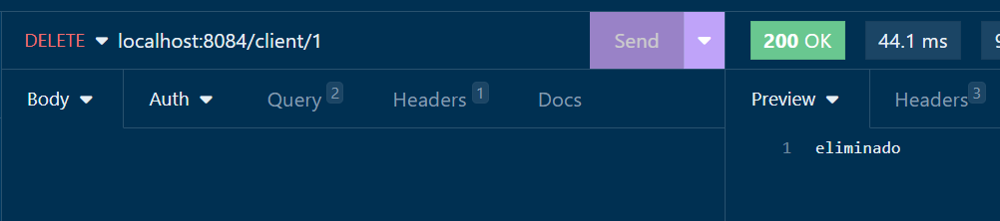

# 3. Diseño de microservicios con Spring Boot 
Crear un microservicio dedicado a la gestión de clientes que permita registrar, actualizar, consultar y eliminar información de clientes de manera segura y eficiente. Este microservicio deberá integrarse en un sistema más amplio en un futuro. 
## Objetivos
- Diseñar un microservicio
- Implementar una fuente de datos externa
- Utilizar Spring Data JPA para la creación del repositorio de datos
- Implementar un controlador que expone las operaciones de http fuera del microservicio

---

<div style="width: 400px;">
        <table width="50%">
            <tr>
                <td style="text-align: center;">
                    <a href="../Capitulo2/README.md"></a>
                    <br>anterior
                </td>
                <td style="text-align: center;">
                   <a href="../README.md">Lista Laboratorios</a>
                </td>
<td style="text-align: center;">
                    <a href="../Capitulo4/README.md"></a>
                    <br>siguiente
                </td>
            </tr>
        </table>
</div>

---


## Diagrama


## Instrucciones
Esta práctica se separa en las siguientes secciones:

- **[Configuración MySQL](#configuración-mysql-instrucciones)**
- **[Codificación Microservicio](#codificación-microservicio-instrucciones)**
- **[Resultado esperado](#resultado-esperado-instrucciones)**


## Configuración MySQL [Instrucciones](#instrucciones)
1. Abrir **MySQL 8 Command Line  Client** 

> **NOTA** Es posible que nos pida un password, este password se encuentra en un archivo en el escritorio de la máquina virtual (ó si se esta usando su equipo de cómputo escribir el password configurado)


2. Usando la terminal de mysql ejecutar el siguiente comando:

```sql
create database micro1;
```


3. Información necesaria para la codificación del microservicio:
- **Database name**: micro1
- **Server**: localhost
- **Port**: 3306 

> **Nota**: el puerto y el server pueden cambiar si el servidor de base de datos esta remoto


## Codificación Microservicio [Instrucciones](#instrucciones)

1. Abrir **Spring Tool Suite**
2. Crear un nuevo proyecto **File**->**New**->**Spring Starter Project**


3. Configuración inicial del projecto:
- **Name**: MicroserviceClient
- **Type**: Maven
- **Packaging**: jar
- **Lenguage**: java
- **Java versión**: 17
- **Group**: com.bancolombia
- **Version**: 1.0.0
- **Description**: my client microservice
- **package**: com.bancolombia.app

4. Dependencies
- **Spring Web**
- **Spring Boot DevTools**
- **Spring Data JPA**
- **MySQL Driver**

5. Esperamos a que el proyecto termine de crearse. 

6. Creamos los paquetes donde pondremos el código **src/main/java**->**com.bancolombia.app CLICK DERECHO**-> **new**-> **package** **x4**

- **entities**
- **dao**
- **services**
- **controller**


7. En el paquete **entities** añadimos el siguiente código

**Client.java** (*java class*)

```java
package com.bancolombia.app.entities;

import jakarta.persistence.Column;
import jakarta.persistence.Entity;
import jakarta.persistence.GeneratedValue;
import jakarta.persistence.GenerationType;
import jakarta.persistence.Id;
import jakarta.persistence.Table;

@Entity
@Table(name="clients")
public class Client {
	@Id
	@GeneratedValue(strategy = GenerationType.IDENTITY)
	private long id;
	@Column(length = 50)
	private String name;
	@Column(length=100)
	private String email;
	@Column(length=200)
	private String address;
	public long getId() {
		return id;
	}
	public void setId(long id) {
		this.id = id;
	}
	public String getName() {
		return name;
	}
	public void setName(String name) {
		this.name = name;
	}
	public String getEmail() {
		return email;
	}
	public void setEmail(String email) {
		this.email = email;
	}
	public String getAddress() {
		return address;
	}
	public void setAddress(String address) {
		this.address = address;
	}

}
```
8. En el paquete **dao** añadimos el siguiente código:

**IClientDAO** (*java interface*)

```java
package com.bancolombia.app.dao;

import org.springframework.data.repository.CrudRepository;

import com.bancolombia.app.entities.Client;

public interface IClientDAO extends CrudRepository<Client, Long> {

}
```

9. En el paquete **services** añadimos el siguiente código:

**IService.java** (*java interface*)

```java
package com.bancolombia.app.services;

import java.util.List;

import com.bancolombia.app.entities.Client;

public interface IService {
	boolean insert(Client client);
	boolean deleteById(long id);
	boolean update(Client client);
	Client findById(long id);
	List<Client> getAll();
}
```

**ServiceImpl.java** (*java class*)

```java
package com.bancolombia.app.services;

import java.util.List;

import org.springframework.beans.factory.annotation.Autowired;
import org.springframework.stereotype.Service;

import com.bancolombia.app.dao.IClientDAO;
import com.bancolombia.app.entities.Client;

@Service
public class ServiceImpl implements IService {
	
	@Autowired
	private IClientDAO dao;

	@Override
	public boolean insert(Client client) {
		if(dao.save(client)!=null) {
		   return true;
		}
		
		return false;
	}

	@Override
	public boolean deleteById(long id) {
		if(dao.existsById(id)) {
		    dao.deleteById(id);
		    return true;
			
		}
		
		return false;
	}

	@Override
	public boolean update(Client client) {
	    if(dao.existsById(client.getId())) {
	    	dao.save(client);
	    	return true;
	    }
		
		return false;
	}

	@Override
	public Client findById(long id) {
		return dao.findById(id)
				.orElseThrow();
	}

	@Override
	public List<Client> getAll() {
		return (List<Client>)dao.findAll();
	}

}
```
10. En el paquete **controller** añadir el siguiente código:

**MicroController.java**(*java class*)

```java
package com.bancolombia.app.controller;

import java.util.List;
import java.util.NoSuchElementException;

import org.springframework.beans.factory.annotation.Autowired;
import org.springframework.http.HttpStatus;
import org.springframework.http.ResponseEntity;
import org.springframework.web.bind.annotation.DeleteMapping;
import org.springframework.web.bind.annotation.GetMapping;
import org.springframework.web.bind.annotation.PathVariable;
import org.springframework.web.bind.annotation.PostMapping;
import org.springframework.web.bind.annotation.PutMapping;
import org.springframework.web.bind.annotation.RequestBody;
import org.springframework.web.bind.annotation.RequestMapping;
import org.springframework.web.bind.annotation.RestController;

import com.bancolombia.app.entities.Client;
import com.bancolombia.app.services.IService;

@RestController
@RequestMapping("/client")
public class MicroController {
	
	@Autowired
	private IService service;
	
	
	@PostMapping
	public ResponseEntity<String> insert(@RequestBody Client client){
		try {
			if(service.insert(client)) {
				
				return new ResponseEntity<String>("insertado", HttpStatus.CREATED);
			}
			
			return new ResponseEntity<String>("no insertado", HttpStatus.BAD_REQUEST);
		}catch(Exception ex) {
			return new ResponseEntity<String>(ex.getMessage(), HttpStatus.INTERNAL_SERVER_ERROR);
		}
		
	}
	
	
	@GetMapping("/{id}")
	public ResponseEntity<Client> findById(@PathVariable("id") long id){
		try {
		    
			return new ResponseEntity<Client>(service.findById(id), HttpStatus.OK);
			
			
		}catch(NoSuchElementException ex) {
		   return new ResponseEntity<Client>(HttpStatus.NOT_FOUND);
		}catch(Exception ex) {
			
			return new ResponseEntity<Client>(HttpStatus.INTERNAL_SERVER_ERROR);
		}
	} 
	
	@DeleteMapping("/{id}")
	public ResponseEntity<String> deleteById(@PathVariable("id") long id){
		try {
			if(service.deleteById(id)) {
				return new ResponseEntity<String>("eliminado", HttpStatus.OK);
			}
			return new ResponseEntity<String>("no existe", HttpStatus.NOT_FOUND);
			
		}catch(Exception ex) {
			
			return new ResponseEntity<String>("error servidor", 
					HttpStatus.INTERNAL_SERVER_ERROR);
		}
	}
	
	@PutMapping
	public ResponseEntity<String> update(@RequestBody Client client){
		try {
			if(service.update(client)) {
				return new ResponseEntity<String>("actualizado",HttpStatus.OK);
			}
			return new ResponseEntity<String>("no existe", HttpStatus.NOT_FOUND);
			
		}catch(Exception ex) {
			 return new ResponseEntity<String>(ex.getMessage(), HttpStatus.INTERNAL_SERVER_ERROR);
			
		}
		
	}
	
	@GetMapping
	public ResponseEntity<List<Client>> getAll(){
		return new ResponseEntity<List<Client>>(service.getAll(), HttpStatus.OK);
	}
	
}
```

11. Abrir el archivo **application.properties**, **MicroserviceClient**->**src/main/resources**->**application.properties**

**application.properties**

```properties
spring.application.name=micro-client
server.port=8084

#hibernate configuration
spring.jpa.properties.hibernate.dialect=org.hibernate.dialect.MySQLDialect
spring.jpa.hibernate.ddl-auto=update

#datasource
spring.datasource.url=jdbc:mysql://localhost:3306/micro1
spring.datasource.username=root
spring.datasource.password=1234
```

12. Iniciar la aplicación **Click Derecho en el proyecto**->**Run As**->**Spring Boot App**


## Resultado esperado [Instrucciones](#instrucciones)
> **NOTA**: Para realizar las pruebas es necesario iniciar la aplicación

1. Abrir **POSTMAN** o **INSOMNIA**

2. Probar los siguientes enpoints

- ## POST (*insertar cliente*): http://localhost:8084/client


**Body Format**

```json
{
	"address":"montecitos num 8",
	"email":"edgardo@gmail.com",
	"name":"edgardo"
}
```


- ## GET (*obtener todos*):http://localhost:8084/client


- ## PUT (*actualizar*):http://localhost:8084/client

**Body Format**

```json
{
		"id": 2,
		"name": "daniela",
		"email": "daniela@gmail.com",
		"address": "otro montecitos"
}
```


- ## GET (*buscar por id*): http://localhost:8084/client/{id}


- ## DELETE (*eliminar cliente*): http://localhost:8084/client/{id}




