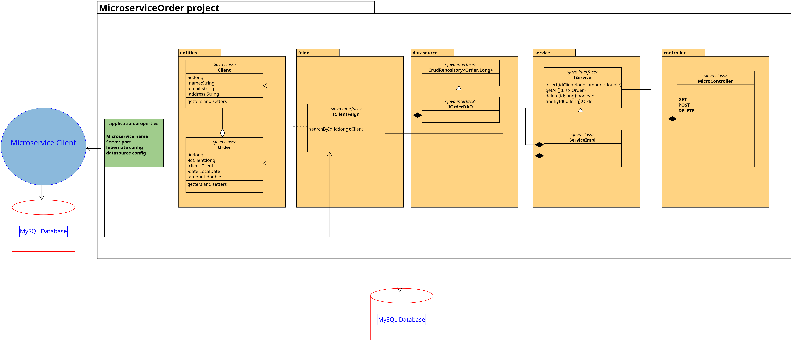
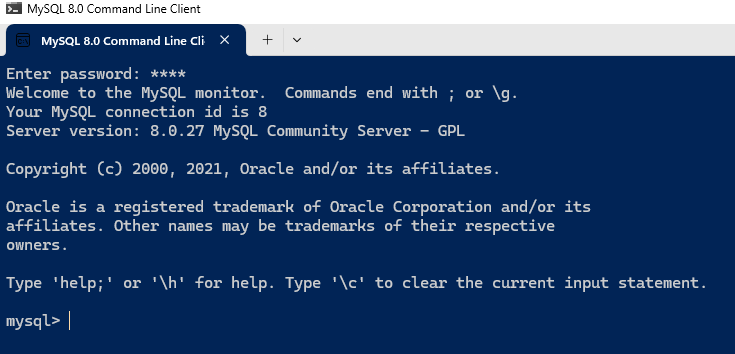
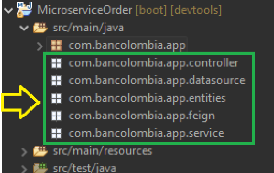
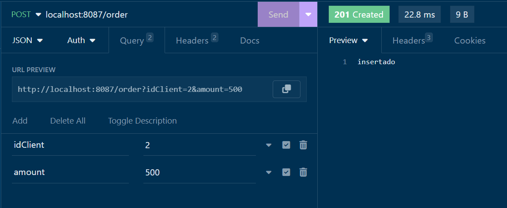
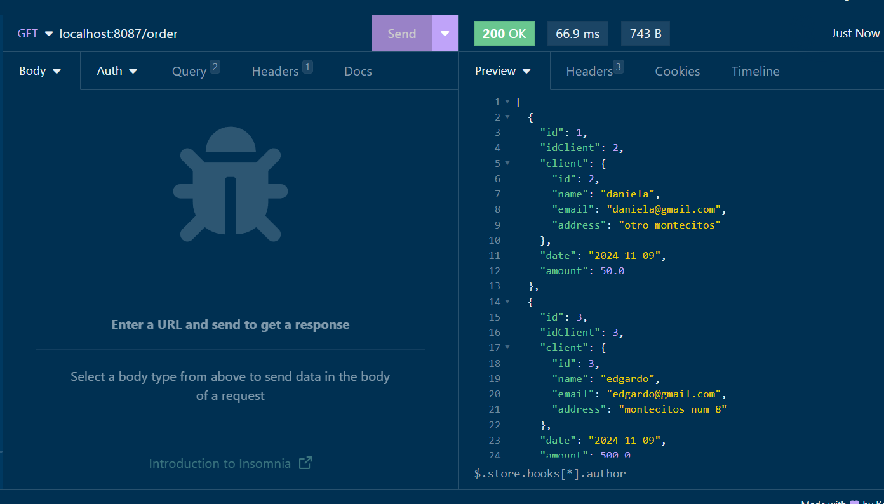
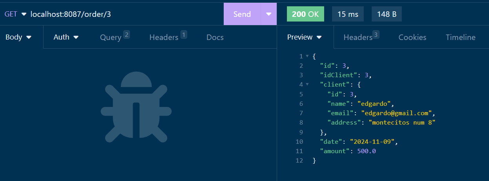
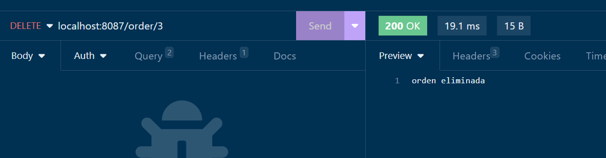

# 4. Implementando comunicación HTTP para los microservicios

En una empresa de ventas solicitan 2 módulos que se van a comunicar entre ellos **Cliente** y **Orden** para llevar el registro de las ordenes y almacenarlas en una base de datos

## Objetivos
- Implementar Feign para comunicar microservicios
- Diseñar interface de comunicación Feign
- Probar la comunicación de microservicios usando postman o insomnia

---

<div style="width: 400px;">
        <table width="50%">
            <tr>
                <td style="text-align: center;">
                    <a href="../Capitulo3/README.md"></a>
                    <br>anterior
                </td>
                <td style="text-align: center;">
                   <a href="../README.md">Lista Laboratorios</a>
                </td>
<td style="text-align: center;">
                    <a href="../Capitulo5/README.md"></a>
                    <br>siguiente
                </td>
            </tr>
        </table>
</div>

---

## Diagrama



## Instrucciones
Este lab esta separado en 3 secciones:

- **[Configuración MySQL](#configuración-mysql-instrucciones)**
- **[Codificación](#codificación-instrucciones)**
- **[Resultado Esperado](#resultado-esperado-instrucciones)**

## Configuración MySQL [instrucciones](#instrucciones)

1. Abrir **MySQL 8 Command Line  Client** 

> **NOTA** Es posible que nos pida un password, este password se encuentra en un archivo en el escritorio de la máquina virtual (ó si se esta usando su equipo de cómputo escribir el password configurado)




2. Usando la terminal de mysql ejecutar el siguiente comando:

```sql
create database micro2;
```


3. Información necesaria para la codificación del microservicio:
- **Database name**: micro2
- **Server**: localhost
- **Port**: 3306 

> **Nota**: el puerto y el server pueden cambiar si el servidor de base de datos esta remoto


## Codificación [instrucciones](#instrucciones)
1. Para este ejercicio es necesario usar el microservicio cliente que se implementó en el módulo anterior. 
> **Nota** en caso de no tener el **MicroserviceClient** puedes descargarlo de la carpeta **[capitulo4](../Capitulo4/)**

2. Iniciar el microservicio cliente e ignorarlo por el momento

3. Crear un nuevo proyecto **File**->**New**->**Spring Starter Project** 

4. Configuración inicial proyecto
- **Name**: MicroserviceOrder
- **Type**: Maven
- **Packaging**: jar
- **Java versión**: 17
- **Language**: java
- **Group**: com.bancolombia
- **Version**: 1.0.0
- **Description**: my order microservice with feign
- **Package**: com.bancolombia.app

5. Dependencies
- **Spring Boot DevTools**
- **Spring Data JPA**
- **MySQL Driver**
- **OpenFeign**
- **Spring Web**

> **IMPORTANTE**: *Es fundamental esperar a que el proyecto este completamente construido* 

6. Creamos los paquetes que contendrán nuestro código **MicroserviceOrder** -> **src/main/java** -> **Click Derecho en com.bancolombia.app** -> **New**-> **Package** (6 veces el mismo proceso)

- **entities**
- **datasource**
- **feign**
- **datasource**
- **service**
- **controller**

### Paquetes en proyecto
> **IMPORTANTE**: Asegurarse que sus paquetes se parezcan a los de la imágen



7. Configuración archivo **application.properties** sustutir el contenido con lo siguiente:

```properties
spring.application.name=micro-order
server.port=8087

#hibernate config
spring.jpa.hibernate.ddl-auto=update
spring.jpa.properties.hibernate.dialect=org.hibernate.dialect.MySQLDialect

#datasource config
spring.datasource.url=jdbc:mysql://localhost:3306/micro2
spring.datasource.username=root
spring.datasource.password=1234
```

8. Código clase principal **src/main/java**->**com.bancolombia.app** -> **MicroserviceOrderApplication.java**

**Clase principal**
```java
package com.bancolombia.app;

import org.springframework.boot.SpringApplication;
import org.springframework.boot.autoconfigure.SpringBootApplication;
import org.springframework.cloud.openfeign.EnableFeignClients;


@EnableFeignClients
@SpringBootApplication
public class MicroserviceOrderApplication {

	public static void main(String[] args) {
		SpringApplication.run(MicroserviceOrderApplication.class, args);
	}

}
```


9. Código paquete **entities**

**Client.java**
```java
package com.bancolombia.app.entities;

public class Client {
	private long id;
	private String name;
	private String email;
	private String address;
	public long getId() {
		return id;
	}
	public void setId(long id) {
		this.id = id;
	}
	public String getName() {
		return name;
	}
	public void setName(String name) {
		this.name = name;
	}
	public String getEmail() {
		return email;
	}
	public void setEmail(String email) {
		this.email = email;
	}
	public String getAddress() {
		return address;
	}
	public void setAddress(String address) {
		this.address = address;
	}

}
```

**Order.java**
```java
package com.bancolombia.app.entities;

import java.time.LocalDate;

import jakarta.persistence.Column;
import jakarta.persistence.Entity;
import jakarta.persistence.GeneratedValue;
import jakarta.persistence.GenerationType;
import jakarta.persistence.Id;
import jakarta.persistence.Table;
import jakarta.persistence.Transient;

@Entity
@Table(name="orders")
public class Order {
	@Id
	@GeneratedValue(strategy = GenerationType.IDENTITY)
	private long id;
    @Column(name="idclient")	
	private long idClient;
    @Transient
	private Client client;
	private LocalDate date;
	private double amount;
	public long getId() {
		return id;
	}
	public void setId(long id) {
		this.id = id;
	}
	public long getIdClient() {
		return idClient;
	}
	public void setIdClient(long idClient) {
		this.idClient = idClient;
	}
	public Client getClient() {
		return client;
	}
	public void setClient(Client client) {
		this.client = client;
	}
	public LocalDate getDate() {
		return date;
	}
	public void setDate(LocalDate date) {
		this.date = date;
	}
	public double getAmount() {
		return amount;
	}
	public void setAmount(double amount) {
		this.amount = amount;
	}

}
```

10. Código paquete **feign**

**IClientFeign.java**
```java
package com.bancolombia.app.feign;

import org.springframework.cloud.openfeign.FeignClient;
import org.springframework.web.bind.annotation.GetMapping;
import org.springframework.web.bind.annotation.PathVariable;

import com.bancolombia.app.entities.Client;

@FeignClient(name="micro-client", url = "http://localhost:8084/client")
public interface IClientFeign {
	
	@GetMapping("/{id}")
	Client findById(@PathVariable("id") long id);

}
```

11. Código paquete **datasource**

**IOrderDAO.java**
```java
package com.bancolombia.app.datasource;

import org.springframework.data.repository.CrudRepository;

import com.bancolombia.app.entities.Order;

public interface IOrderDAO extends CrudRepository<Order, Long>{
}
```

12. Código paquete **service**

**IService.java**
```java
package com.bancolombia.app.service;

import java.util.List;

import com.bancolombia.app.entities.Order;

public interface IService {
	boolean insert(long idClient, double amount);
	boolean delete(long id);
	List<Order> getAll();
	Order findById(long id);
}
```

**ServiceImpl.java**
```java
package com.bancolombia.app.service;

import java.time.LocalDate;
import java.util.List;

import org.springframework.beans.factory.annotation.Autowired;
import org.springframework.stereotype.Service;

import com.bancolombia.app.datasource.IOrderDAO;
import com.bancolombia.app.entities.Client;
import com.bancolombia.app.entities.Order;
import com.bancolombia.app.feign.IClientFeign;

import feign.FeignException.NotFound;

@Service
public class ServiceImpl implements IService {
	
	@Autowired
	private IOrderDAO dao;
	@Autowired
	private IClientFeign feign;
	

	@Override
	public boolean insert(long idClient, double amount) {
	    try {
	    	Client feignResponse= feign.findById(idClient);
	    	Order order=new Order();
	    	order.setIdClient(feignResponse.getId());
	    	order.setAmount(amount);
	    	order.setDate(LocalDate.now());
	    	dao.save(order);
	    	return true;
	    }catch(NotFound ex ) {
	    	return false;
	    }catch(Exception ex) {
	    	throw ex;
	    }
		
	}

	@Override
	public boolean delete(long id) {
		if(dao.existsById(id)) {
			dao.deleteById(id);
			return true;
		}
		return false;
	}

	@Override
	public List<Order> getAll() {
		return ((List<Order>)dao.findAll()).stream()
				.peek(t->t.setClient(feign.findById(t.getIdClient())))
				.toList();
		
	}

	@Override
	public Order findById(long id) {	
		return dao.findById(id)
				.stream()
				.peek(t->t.setClient(feign.findById(t.getIdClient())))
				.findFirst()
				.orElseThrow();
	}

}
```

13. Código paquete **controller**

**MicroController.java**

```java
package com.bancolombia.app.controller;

import java.util.List;
import java.util.NoSuchElementException;

import org.springframework.beans.factory.annotation.Autowired;
import org.springframework.http.HttpStatus;
import org.springframework.http.ResponseEntity;
import org.springframework.web.bind.annotation.DeleteMapping;
import org.springframework.web.bind.annotation.GetMapping;
import org.springframework.web.bind.annotation.PathVariable;
import org.springframework.web.bind.annotation.PostMapping;
import org.springframework.web.bind.annotation.RequestMapping;
import org.springframework.web.bind.annotation.RequestParam;
import org.springframework.web.bind.annotation.RestController;

import com.bancolombia.app.entities.Order;
import com.bancolombia.app.service.IService;

@RestController
@RequestMapping("/order")
public class MicroController {
	@Autowired
	private IService service;
	
	@PostMapping
	public ResponseEntity<String> insert(
		@RequestParam	long idClient, 
		@RequestParam	double amount){
		
		try {
			if(service.insert(idClient, amount)) {
				return new ResponseEntity<String>("insertado",HttpStatus.CREATED);
			}
			return new ResponseEntity<String>("Cliente "+idClient+" no existe", HttpStatus.NOT_FOUND);
			
		}catch(Exception ex) {
			return new ResponseEntity<String>(ex.getMessage(),HttpStatus.INTERNAL_SERVER_ERROR);
		}
		
	}
	
	@GetMapping
	public ResponseEntity<List<Order>> getAll(){
		
		try {
			return new ResponseEntity<List<Order>>(
					service.getAll(), 
					HttpStatus.OK);
			
		}catch(Exception ex) {
			return new ResponseEntity<List<Order>>(HttpStatus.INTERNAL_SERVER_ERROR);
		}
	}
	
	
	@DeleteMapping("/{id}")
	public ResponseEntity<String> delete(@PathVariable("id") long id){
		try {
			if(service.delete(id)) {
				return new ResponseEntity<String>(
						"orden eliminada", 
						HttpStatus.OK);
			}
			
			return new ResponseEntity<String>(
					"orden no existe", 
					HttpStatus.NOT_FOUND);
			
		}catch(Exception ex) {
			
			return new ResponseEntity<String>(
					ex.getMessage(),
					HttpStatus.INTERNAL_SERVER_ERROR
					);
		}
		
	}
	
	@GetMapping("/{id}")
	public ResponseEntity<Order> getById(@PathVariable("id") long id){
		try {
			return new ResponseEntity<Order>(service.findById(id), 
					HttpStatus.OK);
			
		}catch(NoSuchElementException ex) {
			return new ResponseEntity<Order>(HttpStatus.NOT_FOUND);
		}catch(Exception ex) {
			System.out.println(ex);
			return new ResponseEntity<Order>(HttpStatus.INTERNAL_SERVER_ERROR);
		}
		
	}
	
}
```
14. Guardar todo e iniciar la aplicación **Click Derecho en el proyecto** -> **Run As** -> **Spring Boot App**


## Resultado Esperado [instrucciones](#instrucciones)
Para validar que todo funciona correctamente probar los siguiente endpoints usando **POSTMAN** | **INSOMNIA**

- ## POST (insertar orden): http://localhost:8087/order?idClient=2&amount=500




- ## GET (Obtener todas las ordenes): http://localhost:8087/order



- ## GET By ID (Obtener orden por id): http://localhost:8087/order/3



- ## DELETE (Eliminar una orden): http://localhost:8087/order/2

