# 5. Aislando configuración de microservicio con Spring Cloud
En la empresa netec se requiere implementar un servicio que permite externalizar la configuración de los microservicios, para cumplir con los 12 factores de heroku. 

## Objetivos
- Crear microservicio para aislar la configuración
- Configuración de Spring Cloud Config
- Creación de repositorio para la gestión de configuración
- Pruebas de configuración

---
<div style="width: 400px;">
        <table width="50%">
            <tr>
                <td style="text-align: center;">
                    <a href="../Capitulo4/README.md"></a>
                    <br>anterior
                </td>
                <td style="text-align: center;">
                   <a href="../README.md">Lista Laboratorios</a>
                </td>
<td style="text-align: center;">
                    <a href="../Capitulo6/README.md"></a>
                    <br>siguiente
                </td>
            </tr>
        </table>
</div>

---

## Diagrama

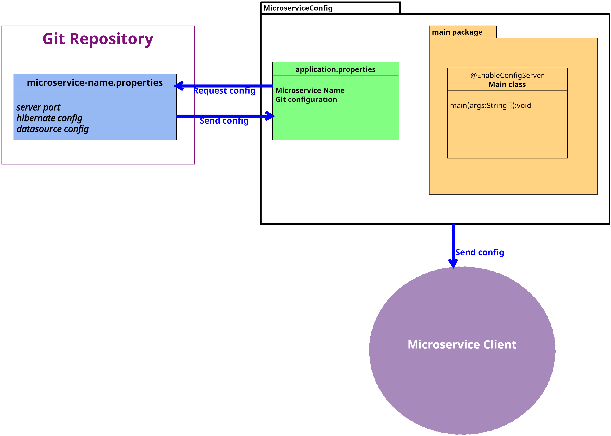


## Instrucciones
Este laboratorio esta separado en 4 secciones

- **[Configuración Git](#configuración-git-instrucciones)**
- **[Crear MicroserviceConfig](#crear-microserviceconfig-instrucciones)**
- **[Configuración MicroserviceClient](#configuración-microserviceclient-instrucciones)**
- **[Resultado esperado](#resultado-esperado-instrucciones)**

## Configuración Git [Instrucciones](#instrucciones)
1. Asegurarse que este instalado **git** en nuestro equipo de cómputo. 

```bash
git version
```
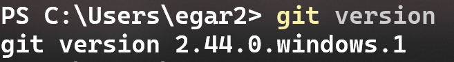

> **NOTA**: En el dado caso que no este instalado, descargarlo del siguiente enlace: https://git-scm.com/downloads

2. Configurar el email global de git

```sh
git config --global user.email "edgardo.nvf@gmail.com"
```
> **IMPORTANTE**: De preferencia usar un correo electrónico personal

3. Configurar el user global de git

```sh
git config --global user.name "edgardo"
```

> **IMPORTANTE**: Cambiar por su nombre


4. Estando en la terminal de windows dirigirnos al escritorio

5. En el escritorio crear una carpeta con el siguiente comando:

```bash
mkdir repositorio
```

6. Abrir la terminal en la carpeta repositorio y ejecutar el siguiente comando: 


```bash
git init
```
*este comando crea un repositorio*

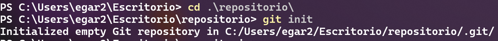

7. En la carpeta **repositorio** crearemos un archivo con nombre **micro-client.properties** y le añadimos el siguiente contenido:

```properties
server.port=8084

#hibernate configuration
spring.jpa.properties.hibernate.dialect=org.hibernate.dialect.MySQLDialect
spring.jpa.hibernate.ddl-auto=update

#datasource
spring.datasource.url=jdbc:mysql://localhost:3306/micro1
spring.datasource.username=root
spring.datasource.password=1234
```

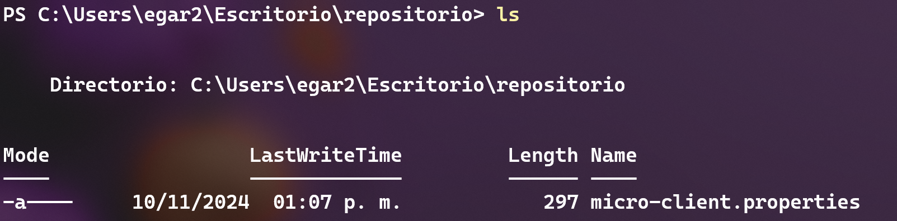

> **IMPORTANTE**: El nombre del archivo debe de ser el mismo nombre que tenga el microservicio client en el archivo **properties**

8. Agregamos los cambios desde la terminal

```bash
git add .
```


9. Confirmamos los cambios

```bash
git commit -m "configuration"
```
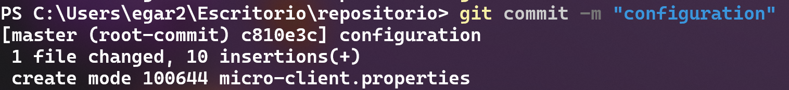

10. Validamos que no haya nada que confirmar. 

```bash
git status
```
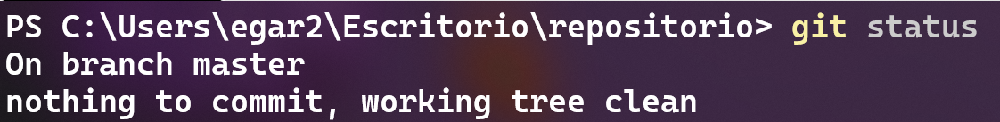


## Crear MicroserviceConfig [Instrucciones](#instrucciones)

1. Abrir **Spring Tool Suite**
2. Crear un nuevo proyecto **File**-> **New**-> **Spring Starter Project**

3. Configuración Inical proyecto

- **Name**: MicroserviceConfig
- **Type**: Maven
- **Packaging**: Jar
- **Language**: Java
- **Java Version**: 17
- **Group**: com.bancolombia
- **Version**: 1.0.0
- **Description**: my config microservice
- **package**: com.bancolombia.app

4. Dependencies

- **Spring Boot DevTools**
- **Config Server**


5. Esperamos a que el proyecto termine de crearse. 

6. Añadimos la anotacion *@EnableConfigServer* en la clase principal **MicroserviceConfig**->**src/main/java**->**com.bancolombia.app**->**MicroserviceConfigApplication.java**

**MicroserviceConfigApplication.java**
```java
package com.bancolombia.app;

import org.springframework.boot.SpringApplication;
import org.springframework.boot.autoconfigure.SpringBootApplication;
import org.springframework.cloud.config.server.EnableConfigServer;

@EnableConfigServer //aquí se agrega
@SpringBootApplication
public class MicroserviceConfigApplication {

	public static void main(String[] args) {
		SpringApplication.run(MicroserviceConfigApplication.class, args);
	}

}
```

7. Ahora añadimos la siguiente configuración en el archivo **application.properties**


8. Guardar todo e iniciar el microservicio **Click Derecho al proyecto MicroserviceConfig**->**Run As**->**Spring Boot App**

9. Abrir **POSTMAN** ó **INSOMNIA** y probar el siguiente endpoint

**GET**
```text
http://localhost:8888/micro-client/default
```
 **Deberías de observar el siguiente contenido**

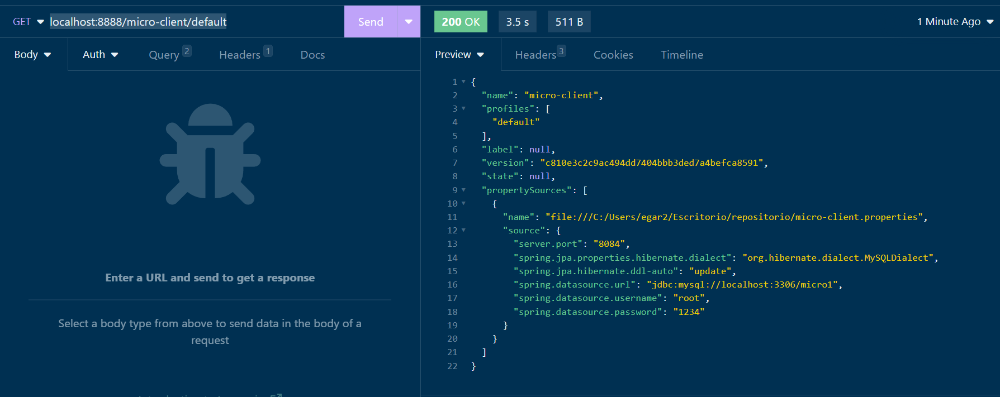

*Si observas te retorna el contenido del archivo **micro-client.properties** que se encuentra en el repositorio*


## Configuración MicroserviceClient [Instrucciones](#instrucciones)

1. Para esta sección necesitaremos al **microservicio cliente** que creamos en el capítulo 3 en el dado caso que no lo tenga, puede descargardo de la carpeta **[Capítulo 5](../Capitulo5/)**

2. En el archivo **pom.xml** añadimos la siguiente dependencia en la sección de **< dependencies >**. 

```xml
<dependency>
    <groupId>org.springframework.cloud</groupId>
	<artifactId>spring-cloud-starter-config</artifactId>
</dependency>
```

3. Módificamos el archivo **application.properties** con el siguiente contenido:

```properties
spring.application.name=micro-client

#Path config service
spring.config.import=optional:configserver:http://localhost:8888
```


4. Iniciamos el microservicio cliente **Click Derecho proyecto MicroserviceClient**-> **Run As**-> **Spring Boot App**

5. El microservicio debería funcionar con normalidad


## Resultado Esperado [Instrucciones](#instrucciones)

> **IMPORTANTE**: Si se ha llegado hasta aquí, el microservicio cliente debería de funcionar igual. Lo único que cambiar es que ahora la configuración ya no esta en el microservicio, si no que ahora se encuentra centralizado en el microservicio config. 

1. Abrir **POSTMAN** o **INSOMNIA**

2. Probar los siguientes enpoints

- ## POST (*insertar cliente*): http://localhost:8084/client


**Body Format**

```json
{
	"address":"montecitos num 8",
	"email":"edgardo@gmail.com",
	"name":"edgardo"
}
```

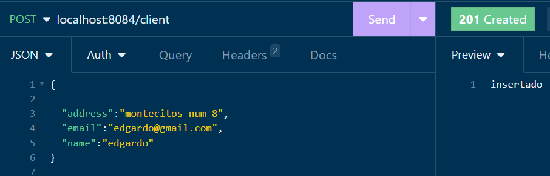


- ## GET (*obtener todos*):http://localhost:8084/client

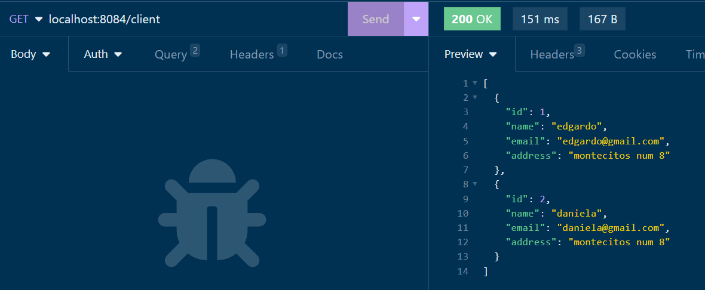

- ## PUT (*actualizar*):http://localhost:8084/client

**Body Format**

```json
{
		"id": 2,
		"name": "daniela",
		"email": "daniela@gmail.com",
		"address": "otro montecitos"
}
```

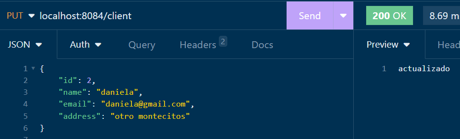

- ## GET (*buscar por id*): http://localhost:8084/client/{id}

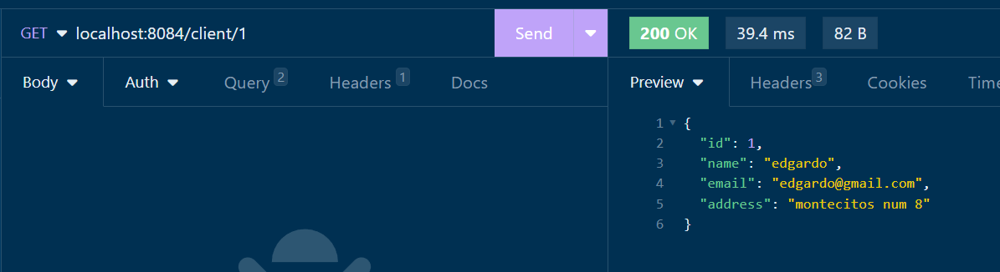

- ## DELETE (*eliminar cliente*): http://localhost:8084/client/{id}


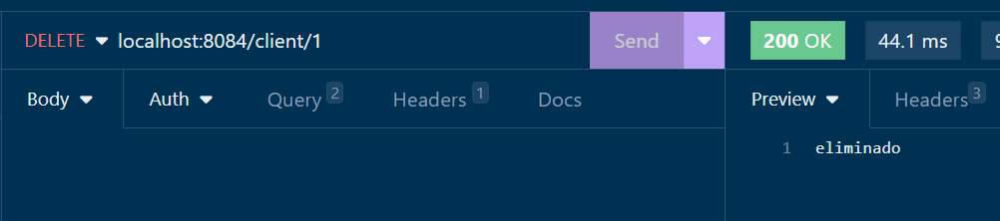