# 6. Asegurando microservicio con Autenticación JWT
La empresa netec requiere que se aseguren los endpoints del microservicio cliente, permitiendo sólo el acceso a aquellos usuarios que esten registrados en el Directorio de Usuarios de la empresa. 

## Objetivos
- Usar Spring Security en microservicio
- Implementar autenticación JWT usando a Keycloak
- Configuración de identity provider (Keycloak)

---

<div style="width: 400px;">
        <table width="50%">
            <tr>
                <td style="text-align: center;">
                    <a href="../Capitulo5/README.md"></a>
                    <br>anterior
                </td>
                <td style="text-align: center;">
                   <a href="../README.md">Lista Laboratorios</a>
                </td>
<td style="text-align: center;">
                    <a href="../Capitulo7/README.md"></a>
                    <br>siguiente
                </td>
            </tr>
        </table>
</div>

---


## Diagrama

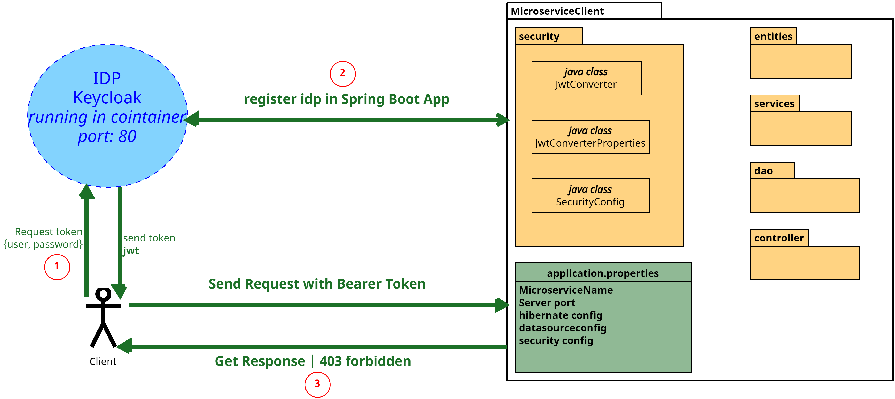

## Instrucciones
Este laboratorio se separa en las siguientes secciones:

- **[Configuración keycloak](#configuración-keycloak-instrucciones)**
- **[Codificación MicroserviceClient](#codificación-microserviceclient-instrucciones)**
- **[Resultado esperado](#resultado-esperado-instrucciones)**


## Configuración Keycloak [Instrucciones](#instrucciones)
1. Para este laboratorio se necesita que **docker este instalado e iniciado**

2. Abrir una terminar y ejecutar el siguiente comando:

```bash
docker run -p 80:8080 --name idp -e KEYCLOAK_PASSWORD=pass -e KEYCLOAK_USER=admin -e PROXY_ADDRESS_FORWARDING=true -d edgardovefe/clase_seguridad:keycloak
```

> **NOTA**: El comando anterior inicia un contenedor con **Keycloak** y lo expone por el 
puerto 80. 

> **IMPORTANTE**: El usuario configurado es **admin** y el password es **pass**

3. Abrir un nuevo explorador web y escribir la siguiente ruta: http://localhost:80, abrirá la siguiente pantalla.:


4. Seleccionar **Administration Console**

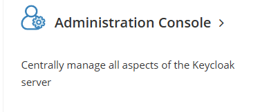

5. Le pedirá usuario y contraseña, **recuerde**:
- **user**: admin
- **password**: pass

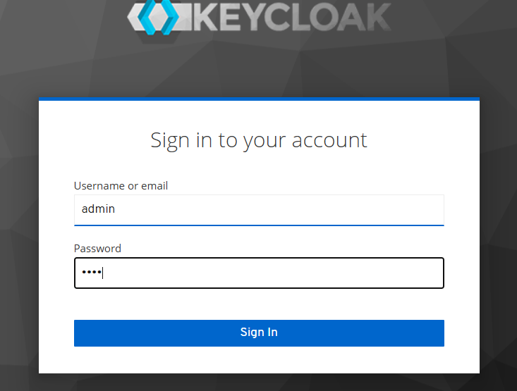


6. Crear un Realm (Conocido cómo dominio de usuarios)

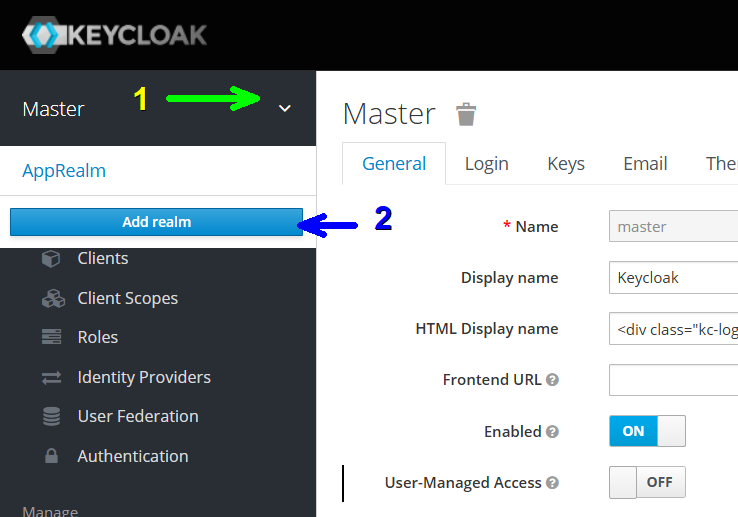


7. Nombre del Realm **netec** (puede cambiar el nombre pero **recuerdelo**). 

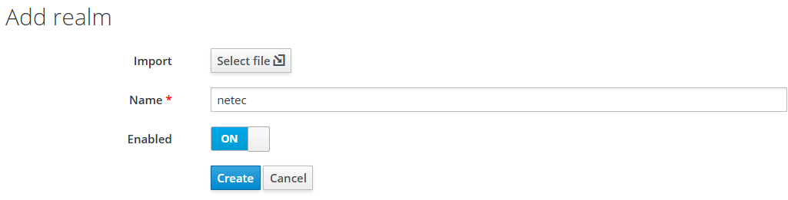


8. Crear un cliente 

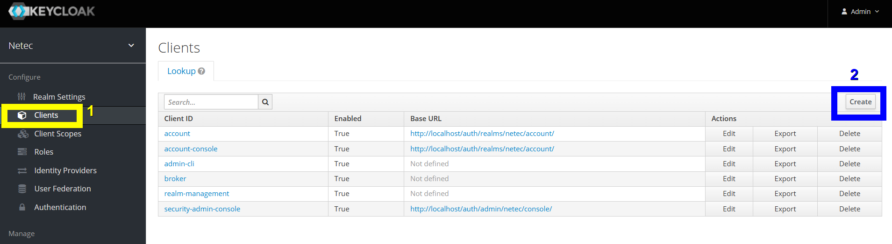

9. Configuración de cliente:
- **Client ID**: myclient
- **Client Procotol**: openid-connect

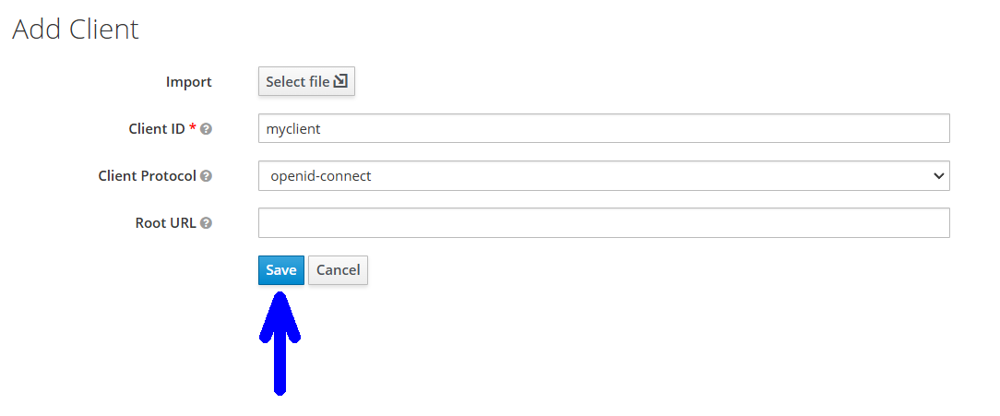

10. Configuramos el url del MicroservicieClient en el cliente **myclient**->**settings**:

- **Valid Redirect URIs**: http://localhost:8084/*

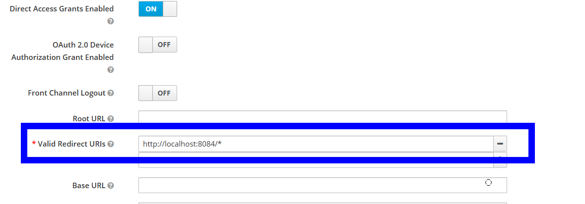

11. **(Opcional)** Cambiar la duración del access token a 30 min o menos (si no se cambia la duración cada token sólo podrá usarse una vez) **myclient**->**settings**->**Advanced Settings**

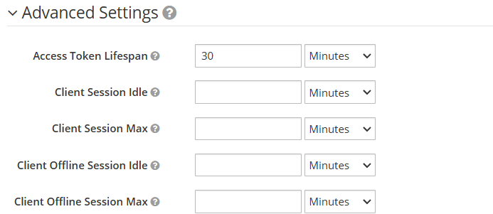

12. Crear usuario 

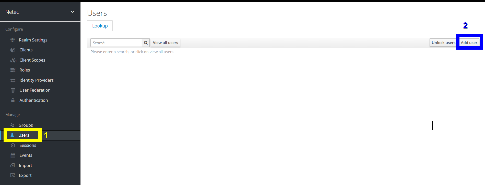

13. Datos usuarios:
- **Username**: user1:
- **Email**: user1@test.com

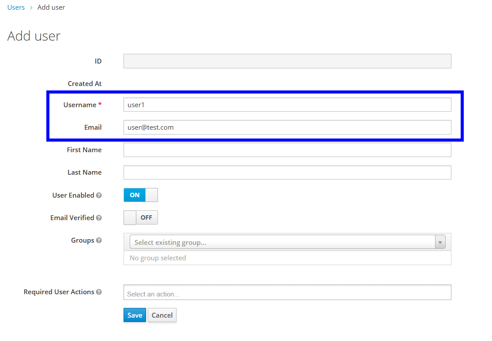

14. Agregar credenciales al usuario, añadir **123456**

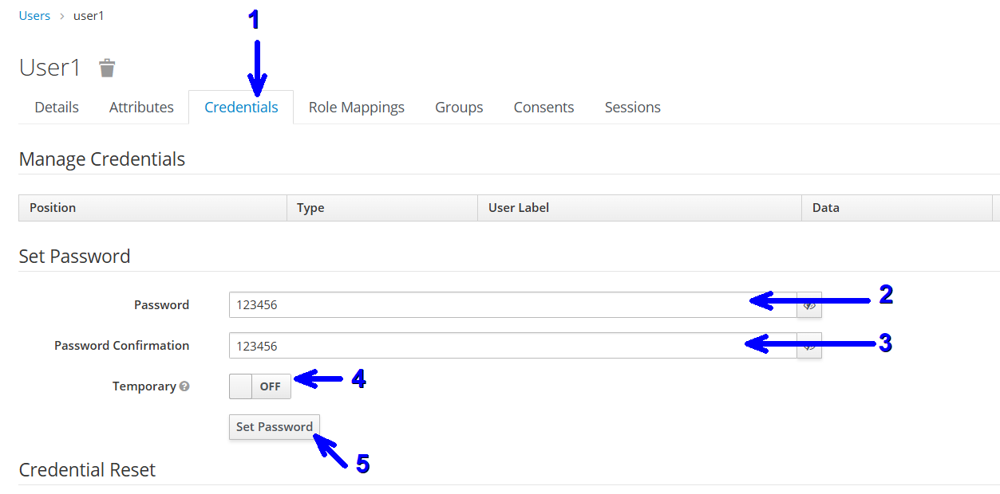

15. Extraemos la información necesaria para Spring boot **Realm Settings**->**Endpoints**->**OpenID Endpoint Configuration**

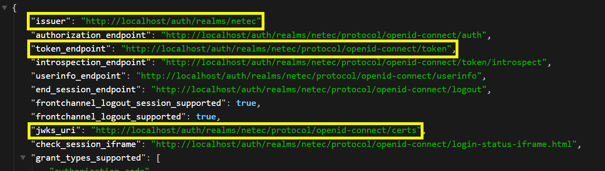

**Explicación de cada endpoint**
- **issuer**: endpoint necesario para la conexión de keycloak con spring boot

- **jwks_uri**: Contiene las llaves publicas para verificar el JWT, también es necesario para spring boot

- **token_endpoint**: Es usado para obtener los access tokens de los usuarios, este lo usa el cliente. 


## Codificación MicroserviceClient [Instrucciones](#instrucciones)

1. Usar el MicroserviceClient creado en el capítulo3 si no se tiene el microservicio descargarlo de la carpeta **[Capitulo6](../Capitulo6/)**


2. Abrir **Spring Tool Suite**

3. Importar el proyecto **MicroserviceClient**,  **File**-> **Import**->**Maven**->**Existing Maven Projects**

4. **(Opcional)** Validar que el microservicio funcione

5. Añadir las siguientes dependencias en el **pom.xml** en la sección de **< dependencies >**
- **Spring Security**
- **OAuth2 Resource Server**

> **IMPORTANTE**: No borres las depedencias que ya tiene el proyecto, recuerde que deseamos proteger el microservicio no cambiar su funcionamiento.

```xml
<!--OAuth2 Resource Server dependency-->
<dependency>
	<groupId>org.springframework.boot</groupId>
	<artifactId>spring-boot-starter-oauth2-resource-server</artifactId>
</dependency>

<!--Spring Security dependency-->
<dependency>
    <groupId>org.springframework.boot</groupId>
	<artifactId>spring-boot-starter-security</artifactId>
</dependency>
```

6. Añadimos la siguiente configuración en el archivo **application.properties**

> **IMPORTANTE**: Esta configuración se agrega al final de la que ya teniamos, no borre la configuración anterior. 

```properties
# Keycloak config
spring.security.oauth2.resourceserver.jwt.issuer-uri=http://localhost/auth/realms/netec
spring.security.oauth2.resourceserver.jwt.jwk-set-uri=http://localhost/auth/realms/netec/protocol/openid-connect/certs

# JWT Config
jwt.auth.converter.resource-id=myclient
jwt.auth.converter.principal-attribute=preferred_username

# Logging Config
logging.level.org.springframework.security=DEBUG
```

**application.properties completo**
```properties
spring.application.name=micro-client
server.port=8084

#hibernate configuration
spring.jpa.properties.hibernate.dialect=org.hibernate.dialect.MySQLDialect
spring.jpa.hibernate.ddl-auto=update

#datasource
spring.datasource.url=jdbc:mysql://localhost:3306/micro1
spring.datasource.username=root
spring.datasource.password=1234

# keycloak config
spring.security.oauth2.resourceserver.jwt.issuer-uri=http://localhost/auth/realms/netec
spring.security.oauth2.resourceserver.jwt.jwk-set-uri=http://localhost/auth/realms/netec/protocol/openid-connect/certs

# JWT Config
jwt.auth.converter.resource-id=myclient
jwt.auth.converter.principal-attribute=preferred_username

# logging Config
logging.level.org.springframework.security=DEBUG
```

7. Creamos un nuevo paquete en **MicroserviceClient**->**src/main/java**->**Click derecho en com.bancolombia.app**->**New**->**package**
- Nombre paquete: **security**

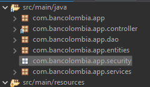


8. Añadir el siguiente código en el paquete security, esto permite que cada request a nuestro microservicio debe de llevar un **access token** 

**JwtConverterProperties.java**
> **NOTA**: Esta clase permite obtener los valores del archivo de propiedades el nombre de nuestro cliente y el atributo principal

```java
package com.bancolombia.app.security;

import org.springframework.boot.context.properties.ConfigurationProperties;
import org.springframework.context.annotation.Configuration;
import org.springframework.validation.annotation.Validated;

@Validated
@Configuration
@ConfigurationProperties(prefix="jwt.auth.converter")
public class JwtConverterProperties {
	private String resourceId;
	private String principalAttribute;
	
	public String getResourceId() {
		return resourceId;
	}
	public void setResourceId(String resourceId) {
		this.resourceId = resourceId;
	}
	public String getPrincipalAttribute() {
		return principalAttribute;
	}
	public void setPrincipalAttribute(String principalAttribute) {
		this.principalAttribute = principalAttribute;
	}
	
}
```

**JwtConverter.java**

> **NOTA**: Esta clase permite que se puedan obtener los claims de nuestro jwt, en este caso sólo se obtienen el user name y los roles (no se usan en el código sólo se usan en los logs)


```java
package com.bancolombia.app.security;

import java.util.Collection;
import java.util.Map;
import java.util.Set;
import java.util.stream.Collectors;
import java.util.stream.Stream;

import org.slf4j.Logger;
import org.slf4j.LoggerFactory;
import org.springframework.core.convert.converter.Converter;
import org.springframework.security.authentication.AbstractAuthenticationToken;
import org.springframework.security.core.GrantedAuthority;
import org.springframework.security.core.authority.SimpleGrantedAuthority;
import org.springframework.security.oauth2.jwt.Jwt;
import org.springframework.security.oauth2.jwt.JwtClaimNames;
import org.springframework.security.oauth2.server.resource.authentication.JwtAuthenticationToken;
import org.springframework.security.oauth2.server.resource.authentication.JwtGrantedAuthoritiesConverter;
import org.springframework.stereotype.Component;

@Component
public class JwtConverter implements Converter<Jwt, AbstractAuthenticationToken> {

    private final JwtGrantedAuthoritiesConverter jwtGrantedAuthoritiesConverter = new JwtGrantedAuthoritiesConverter();

    private final JwtConverterProperties properties;
    
    private final Logger LOGGER= LoggerFactory.getLogger(JwtConverter.class);

    public JwtConverter(JwtConverterProperties properties) {
        this.properties = properties;
    }

    @Override
    public AbstractAuthenticationToken convert(Jwt jwt) {
        Collection<GrantedAuthority> authorities = Stream.concat(
                jwtGrantedAuthoritiesConverter.convert(jwt).stream(),
                extractResourceRoles(jwt).stream()).collect(Collectors.toSet());
        
        
        return new JwtAuthenticationToken(jwt, authorities, getPrincipalClaimName(jwt));
    }

    private String getPrincipalClaimName(Jwt jwt) {
        String claimName = JwtClaimNames.SUB;
        if (properties.getPrincipalAttribute() != null) {
            claimName = properties.getPrincipalAttribute();
        }
        LOGGER.info("Bienvenido: "+jwt.getClaim(claimName));
        return jwt.getClaim(claimName);
    }

    private Collection<? extends GrantedAuthority> extractResourceRoles(Jwt jwt) {
        Map<String, Object> resourceAccess = jwt.getClaim("resource_access");
        Map<String, Object> resource;
        Collection<String> resourceRoles;

        if (resourceAccess == null
                || (resource = (Map<String, Object>) resourceAccess.get(properties.getResourceId())) == null
                || (resourceRoles = (Collection<String>) resource.get("roles")) == null) {
            return Set.of();
        }
        return resourceRoles.stream()
                .map(role -> {
                	LOGGER.info("ROLE: "+role);
                	return new SimpleGrantedAuthority("ROLE_" + role);})
                .collect(Collectors.toSet());
    }
}
```

**SecurityConfig.java**

> **NOTA**: Esta clase permite controlar los endpoints del microservicio que serán autenticados, con la configuración que tiene la clase se esta indicando que cualquier request necesita ser autenticado. 

```java
package com.bancolombia.app.security;


import org.springframework.context.annotation.Bean;
import org.springframework.context.annotation.Configuration;
import org.springframework.security.config.annotation.web.builders.HttpSecurity;
import org.springframework.security.config.annotation.web.configuration.EnableWebSecurity;
import org.springframework.security.config.http.SessionCreationPolicy;
import org.springframework.security.web.SecurityFilterChain;

@Configuration
@EnableWebSecurity
public class SecurityConfig {
    private final JwtConverter jwtConverter;
    
    public SecurityConfig(JwtConverter jwtConverter) {
    	this.jwtConverter=jwtConverter;
    }
    @Bean
    public SecurityFilterChain securityFilterChain(HttpSecurity http) throws Exception {
        http.authorizeHttpRequests((authz) ->authz.anyRequest().authenticated());
               

        http.sessionManagement(sess -> sess.sessionCreationPolicy(
                SessionCreationPolicy.STATELESS));
        http.oauth2ResourceServer(oauth2 -> oauth2.jwt(jwt -> 
          jwt.jwtAuthenticationConverter(jwtConverter)));

        return http.build();
    }
}
```

9. Guardar todo e iniciar el microservicio **Click derecho en MicroserviceClient**->**Run As**->**Spring Boot App**


## Resultado Esperado [Instrucciones](#instrucciones)

1. Probar el microservicio sin Bearer token

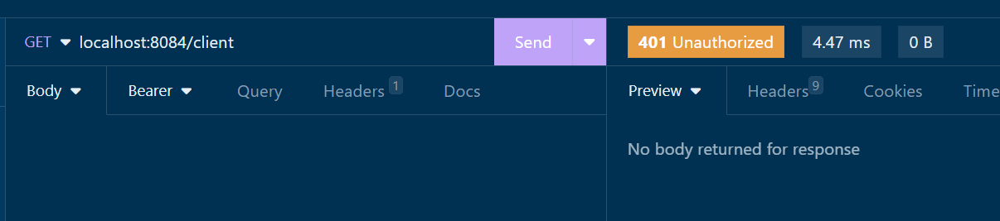

> **NOTA**: Puedes observar que ya no te deja entrar a ningún endpoint. 

2. Generar el **access_token** del usuario **user1** que creamos en la primer sección de este laboratorio.
    - Abrir **Insomnia o Postman**
    - Método **POST** url: http://localhost/auth/realms/netec/protocol/openid-connect/token
    - **Form URL Encoded**
        - **grant_type**: password
        - **client_id**: myclient
        - **username**: user1
        - **password**: 123456

        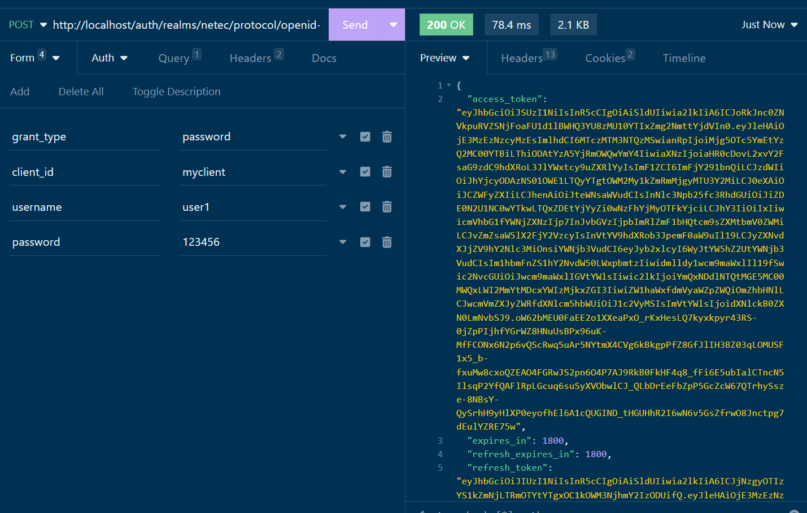

3. Copiamos el **access_token**
> **NOTA**: El **access_token** sólo funciona durante 30 minutos ó si no cambiaste la configuración sólo es de un uso. 

4. Ahora repetimos el acceso al microservicio cliente pero añadimos la siguiente configuración:
    - **GET**: http://localhost:8084/client
    - **Bearer Token**: *access token copiado anteriormente*

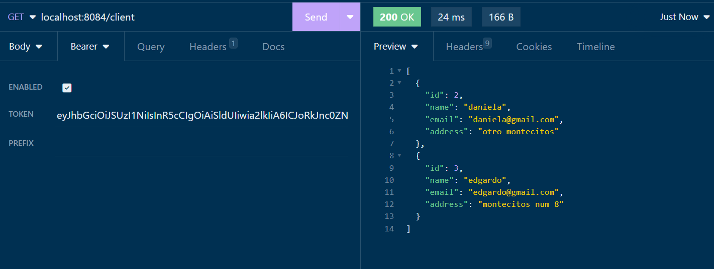

    
5. **(Opcional)**: Probar los demas endpoints del microservicio.


