# 7. CI/CD Github Actions

En este laboratorio exploraremos la integración continúa usando Github Actions y el almacenamiento de nuestra imagen Docker en Docker hub

## Objetivos
- Almacenar el código de un microservicio en un repositorio remoto. 
- Explorar las funcionalidades de **Github Actions**
- Crear un pipeline en **Github Actions**
- Construir una imagen de docker en **Github Actions**

---

<div style="width: 400px;">
        <table width="50%">
            <tr>
                <td style="text-align: center;">
                    <a href="../Capitulo6/README.md"></a>
                    <br>anterior
                </td>
                <td style="text-align: center;">
                   <a href="../README.md">Lista Laboratorios</a>
                </td>
<td style="text-align: center;">
                    <a href="../Capitulo8/README.md"></a>
                    <br>siguiente
                </td>
            </tr>
        </table>
</div>

---


## Diagrama

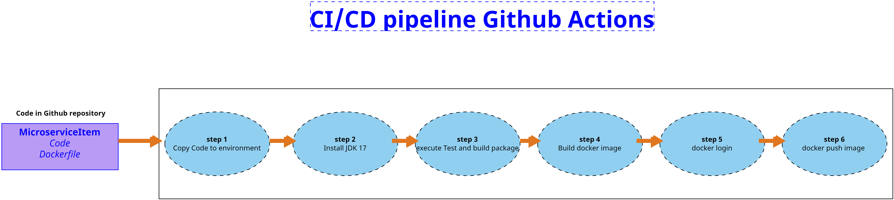


> **IMPORTANTE**: Antes de comenzar es necesario tener una cuenta gratuita de **github** y de **docker hub**, en caso con no contar con ellas crearse las cuentas
en los siguientes enlaces: **[Github](https://github.com/)**, **[Docker hub](https://hub.docker.com/)**

> **IMPORTANTE**: Necesitaremos tu usuario y password de la cuenta de **Dockerhub** más adelante en este Lab

## Instrucciones
Este laboratorio esta dividido en 3 secciones. 

1. **[Configuración Github](#configuración-github-instrucciones)**


2. **[Github Action](#github-action-instrucciones)**


3. **[Resultado Esperado](#resultado-esperado-instrucciones)**

## Configuración Github [Instrucciones](#instrucciones)
1. Para esta primera parte necesitaremos el microservicio item, lo podemos encontrar en la carpeta **[Capitulo6](../Capitulo6/)**

2. Descargar el **MicroservicieItem**

3. **(Opcional)** Abrir el Proyecto en **Visual Studio Code** validar su estructura y **asegurarse que en la raíz del proyecto este el archivo Dockerfile**


    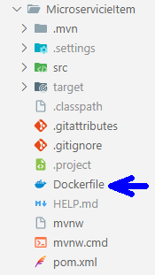

4. Abrir https://github.com/ e iniciar sesión en su cuenta de **Github**

    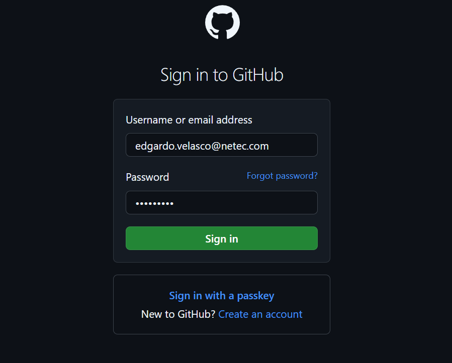


5. Crear un nuevo repositorio 

    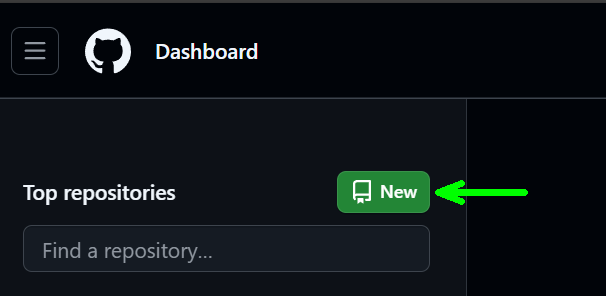

6. Datos del repositorio:
    - **Repository name**: MSClase
    - **Public**

    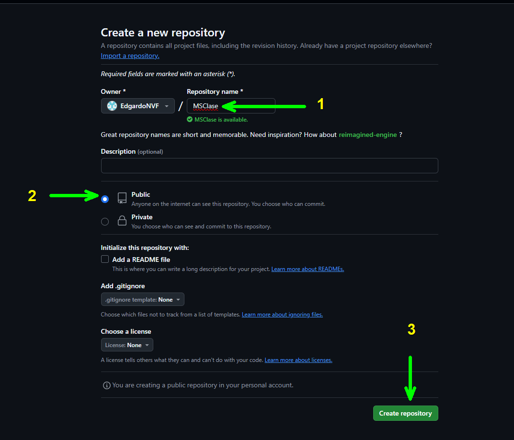

7. Copiar url HTTPS 

    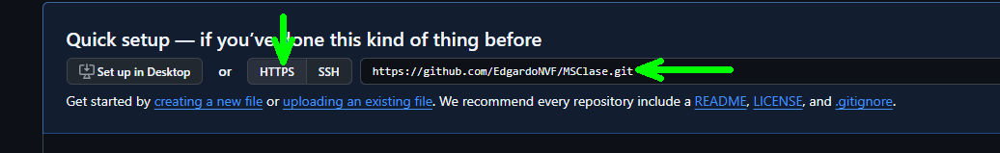

8. Abrir una terminal en tu computadora y dirígete al escritorio:

    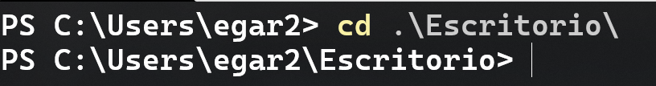

9. Ejecutar el siguiente comando

    ```bash
    git clone https_url
    ```

    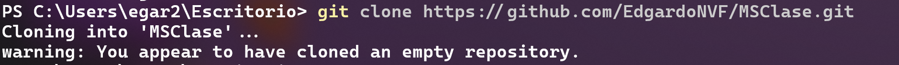

10. En la carpeta **MSClase** que se creo por el comando anterior pegaremos la carpeta del proyecto **MicroservicieItem**

    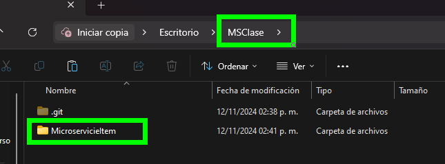


11. Abrimos una nueva terminal en la carpeta **MSClase** y ejecutaremos los siguientes comandos 

    **Añade los archivo a la cola de confirmación**
    ```bash
    git add .
    ```

    **Confirmamos los archivos**
    ```bash
    git commit -m "proyecto item"
    ```

    **Cargamos los archivos al repositorio de Github**
    ```bash
    git push --set-upstream origin main
    ```

> **IMPORTANTE**: El comando git push le pedirá que inicie sesión usando su cuenta de **Github**


12. Abrir su cuenta de github usando un explorador web y navegar hasta su repositorio **MSClase**. Debería de observar su proyecto **MicroservicieItem**

    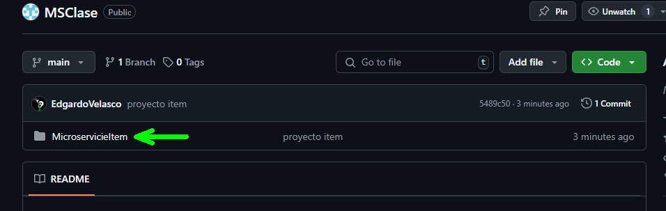

13. Ahora añadiremos 2 secretos en nuestro repositorio de Github que usaremos para nuestro **Github Action**
    - Dentro de nuestro repositorio abrimos **Settings**
    - Ahora **Security**->**Secrets and Variables**->**Actions**
    - **New repository secret** (2 veces)
        - DOCKER_USERNAME: **TU USUARIO DE DOCKER**
        - DOCKER_PASSWORD: **TU PASSWORD DE DOCKER**


        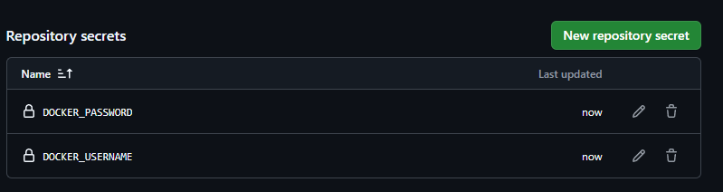

> **IMPORTANTE**: El nombre de los secretos es case sensitive, así que asegúrate que estén escritos igual.


## Github Action [Instrucciones](#instrucciones)

1. Estando en el repositorio **MSClase** dentro de github ir a la pestaña **Actions**

    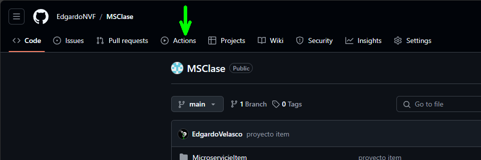

2. Abrir **set up a workflow yourself**

    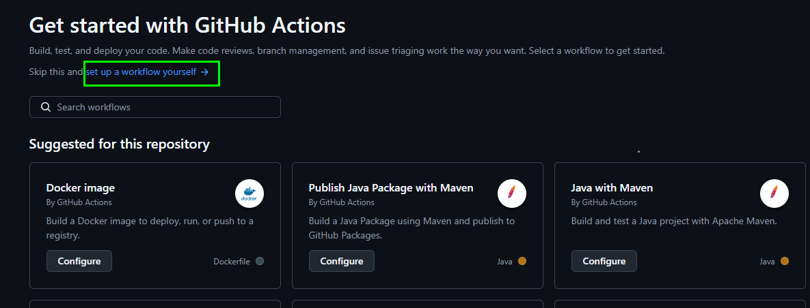

3. Pegar el siguiente **workflow**

```yaml
name: MicroserviceItem CI/CD

on:
  push:
    branches:
      - main
  pull_request:
    branches:
      - main

jobs:
  build:
    runs-on: ubuntu-latest

    steps:
      - name: Checkout code #step 1
        uses: actions/checkout@v2

      - name: Set up JDK #step 2
        uses: actions/setup-java@v2
        with:
          distribution: 'temurin'
          java-version: '17'

      - name: Build with Maven  #step 3
        run: mvn -f MicroservicieItem/pom.xml clean install -DskipTests=false

      - name: List all files in MicroservicieItem
        run: ls -la MicroservicieItem

        
      - name: Build Docker image #step 4
        run: docker build -t ${{ secrets.DOCKER_USERNAME }}/myapp:${{ github.sha }} .
        working-directory: MicroservicieItem

      - name: Log in to Docker Hub #step 5
        uses: docker/login-action@v3.3.0
        with:
          username: ${{ secrets.DOCKER_USERNAME }}
          password: ${{ secrets.DOCKER_PASSWORD }}

      - name: Push Docker image to Docker Hub #step 6
        run: |
          docker tag ${{ secrets.DOCKER_USERNAME }}/myapp:${{ github.sha }} ${{ secrets.DOCKER_USERNAME }}/myapp:latest
          docker push ${{ secrets.DOCKER_USERNAME }}/myapp:latest
```
4. **Commit changes**

    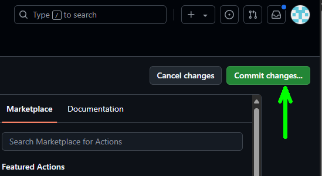

5. Configuración commit 

    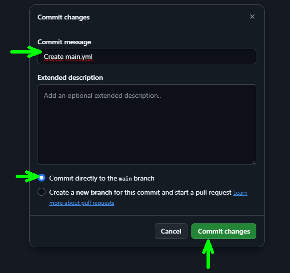

6. Esperar unos minutos y regresar a la pestaña **Actions** y validar que el flujo se haya ejecutado completo

    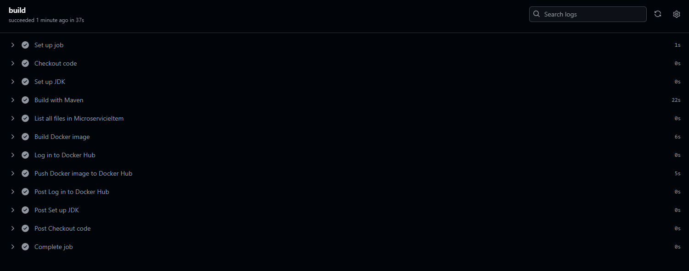

7. Abrir tu **Docker hub** y buscar el repositorio creado por el flujo de **Github Actions**

    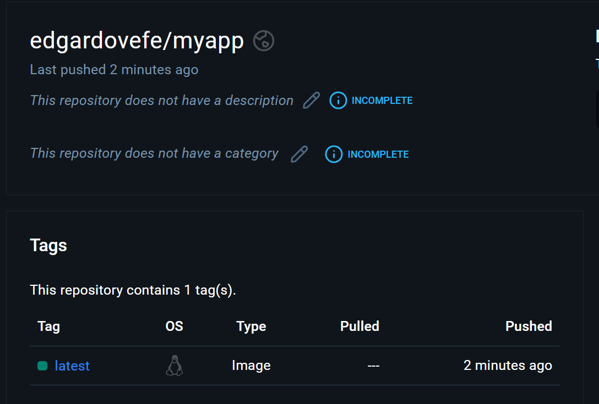


## Resultado esperado [Instrucciones](#instrucciones)

Al final de esta práctica se espera que nuestro microservicio este almacenado en una imagen de docker y debería de observarse de la siguiente manera. 


## Opcional
Probar la imagen desplegando el contenedor en tu computadora. 

Usa el siguiente comando para realizarlo, sólo módifica el nombre de usuario por el tuyo. 


```bash
docker run -p 8081:8081 --name app -d edgardovefe/myapp:latest
```
