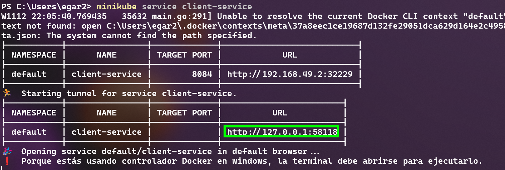

# 8. Despliegue de microservicios con Kubernetes Local
En este laboratorio exploraremos el uso de CI/CD para la creación automatica de imagenes
y el despliegue de 4 microservicios en Kubernetes usando un archivo **yaml**

## Objetivos
- Uso de **Git hub Actions** para generar imágenes de docker
- Configuración de kubernetes
- Despliegue de aplicación en kubernetes

---

<div style="width: 400px;">
        <table width="50%">
            <tr>
                <td style="text-align: center;">
                    <a href="../Capitulo7/README.md"></a>
                    <br>anterior
                </td>
                <td style="text-align: center;">
                   <a href="../README.md">Lista Laboratorios</a>
                </td>
<td style="text-align: center;">
                    <a href="../Capitulo9/README.md"></a>
                    <br>siguiente
                </td>
            </tr>
        </table>
</div>


---


## Diagrama


> **IMPORTANTE**: Antes de comenzar el laboratorio asegurate de tener un clúster de kubernetes
configurado, te recomiendo usar **[Minikube](https://minikube.sigs.k8s.io/docs/start/?arch=%2Fwindows%2Fx86-64%2Fstable%2F.exe+download)** ó puedes usar un clúster en la nube


## Instrucciones
Este laboratorio esta dividido en las siguientes secciones:

- **[Creación de imágenes Docker](#creación-de-imágenes-de-docker-instrucciones)**
- **[Despliegue de microservicios en kubernetes](#despliegue-de-microservicios-en-kubernetes-instrucciones)**
- **[Resultado esperado](#resultado-esperado-instrucciones)**


## Creación de imágenes de Docker [instrucciones](#instrucciones)
1. Para esta sección necesitaremos los proyectos **MicroserviceClient**, **MicroserviceConfig**,
**MicroserviceEureka** que encontraremos en la carpeta **[Capitulo8](../Capitulo8/)**

2. Cargar los proyectos a un repositorio que llamaremos **MSCap8** en Github

> **NOTA**: Si tienes dudas de cómo cargar los proyectos a Github te recomiendo
que repases el **[Laboratorio 7](../Capitulo7/README.md)**

3. Agregar los secretos al repositorio 
- DOCKER_USERNAME= **tu usuario de docker**
- DOCKER_PASSWORD= **tu password de docker**

    

> **NOTA**: Si tienes dudas de cómo crear los **secrets** te recomiendo
que repases el **[Laboratorio 7](../Capitulo7/README.md)**

4. Estando en el repositorio **MSClase** dentro de github ir a la pestaña **Actions**

    

5. Abrir **set up a workflow yourself**

    

6. Pegar el siguiente **WorkFlow**

```yaml
name: Microservices Build docker hub

on:
  push:
    branches:
      - main
  pull_request:
    branches:
      - main

jobs:
  build:
    runs-on: ubuntu-latest

    steps:
      - name: Checkout code
        uses: actions/checkout@v2

      - name: Set up JDK
        uses: actions/setup-java@v2
        with:
          distribution: 'temurin'
          java-version: '17'
          
      # Construccion de jars
      - name: Build Micro Client
        run: mvn -f MicroserviceClient/pom.xml clean install -DskipTests=true

      - name: Build Micro Config
        run: mvn -f MicroserviceConfig/pom.xml clean install -DskipTests=true

      - name: Build Micro Eureka
        run: mvn -f MicroserviceEureka/pom.xml clean install -DskipTests=true


      # Construccion de imagenes
      - name: Build image Client
        run: docker build -t ${{ secrets.DOCKER_USERNAME }}/appm:client .
        working-directory: MicroserviceClient
        
      - name: Build image config
        run: docker build -t ${{ secrets.DOCKER_USERNAME }}/appm:config .
        working-directory: MicroserviceConfig
        
      - name: Build image eureka
        run: docker build -t ${{ secrets.DOCKER_USERNAME }}/appm:eureka .
        working-directory: MicroserviceEureka


      #Login docker
      - name: Log in to Docker Hub 
        uses: docker/login-action@v3.3.0
        with:
          username: ${{ secrets.DOCKER_USERNAME }}
          password: ${{ secrets.DOCKER_PASSWORD }}


        
      #Envio de imagenes a docker hub
      - name: Push Docker image to Docker Hub
        run: |
          docker push ${{ secrets.DOCKER_USERNAME }}/appm:client
          docker push ${{ secrets.DOCKER_USERNAME }}/appm:config
          docker push ${{ secrets.DOCKER_USERNAME }}/appm:eureka
```

7. Realizar el **commit** y esperar que el **pipeline** termine de ejecutarse.

8. Para validar que todo funcionó correctamente entrar a su **Docker hub** y verá algo similar a lo siguiente dentro del repositorio **appm**: 

    


## Despliegue de microservicios en kubernetes [instrucciones](#instrucciones)

1. Iniciar kubernetes

```bash
minikube start --driver=docker
```

2. Esperar que termine de iniciar kubernetes (tarda unos 5 min)

3. Crear un nuevo archivo en el escritorio que llamaremos **app-deploy.yaml**

> **IMPORTANTE**: La extensión es muy importante del archivo, asegúrese que si se haya cambiado

4. Añadir el siguiente contenido al archivo **deploy-app.yaml**

> **NOTA**: Este archivo crea 4 servicios y 4 deployments para los 4 microservicios que se ejecutarán dentro del clúster de kubernetes. **No es necesario modificar nada**

```yaml
#Services Section
apiVersion: v1
kind: Service
metadata:
  name: mysql-service
spec:
  ports:
  - port: 3306
  selector:
    app: mysqlserver
  clusterIP: None

---
apiVersion: v1
kind: Service
metadata:
  name: config-service
spec:
  selector:
    app: configserver
  ports:
  - port: 8888
    targetPort: 8888
  clusterIP: None

---
apiVersion: v1
kind: Service
metadata:
  name: eureka-service
spec:
  selector:
    app: eurekaserver
  ports:
  - port: 9999
    targetPort: 9999
  type: LoadBalancer

---
apiVersion: v1
kind: Service
metadata:
  name: client-service
spec:
  selector:
    app: clientmicro
  ports:
  - port: 8084
    targetPort: 8084
  type: LoadBalancer


---

# Deployments section

apiVersion: apps/v1
kind: Deployment
metadata:
  name:  mysql-deployment
spec:
  selector:
    matchLabels:
      app: mysqlserver
  template:
    metadata:
      labels:
        app: mysqlserver
    spec:
      containers:
      - name: container
        image: library/mysql:8.0
        env:
        - name: MYSQL_ROOT_PASSWORD
          value: netec1234
        - name: MYSQL_DATABASE
          value: micro1


---


apiVersion: apps/v1
kind: Deployment
metadata:
  name: configserver
spec:
  selector:
    matchLabels:
      app: configserver
  template:
    metadata:
      labels:
        app: configserver
    spec:
      containers:
      - name: configserver
        image: edgardovefe/appm:config

---
apiVersion: apps/v1
kind: Deployment
metadata:
  name: eurekaserver
spec:
  selector:
    matchLabels:
      app: eurekaserver
  template:
    metadata:
      labels:
        app: eurekaserver
    spec:
      containers:
      - name: eruekaserver
        image: edgardovefe/appm:eureka

---
apiVersion: apps/v1
kind: Deployment
metadata:
  name: clientmicro
spec:
  selector:
    matchLabels:
      app: clientmicro
  template:
    metadata:
      labels:
        app: clientmicro
    spec:
      containers:
      - name: clientmicro
        image: edgardovefe/appm:client
        env:
          - name: CONFIG_IP
            value: "config-service.default"
          - name: EUREKA_IP
            value: "eureka-service.default"
          - name: MYSQL_IP
            value: "mysql-service.default"
          - name: DATABASE_PASSWORD
            value: netec1234
```

5. Abrir una terminal en la ubicación del archivo **deploy-app.yaml** y ejecutar el siguiente comando: 

    ```bash
    kubectl apply -f deploy-app.yaml
    ```

    

6. Si hemos llegado hasta aquí hemos desplegado nuestros 4 microservicios

## Resultado Esperado [instrucciones](#instrucciones)

1. Abrir una terminal y ejecutar el siguiente comando:

```bash
minikube service client-service
```

2. El comando anterior nos entregará un url

    

3. Copiamos el url y válidamos el funcionamiento de nuestro **Microservicio Cliente** en Insomnia o Postman

    
