# 9. Monitoreo de Microservicios con Prometheus y Grafana

La empresa netec requiere que se pueda monitorear el microservicio cliente para visualizar la cantidad y tipos de logs. Aunque requieren que estas metrícas puedan verse gráficamente.

## Objetivos
- Configuración de Spring boot con prometheus
- Consumir métricas en prometheus y crear gráficas
- Conectar prometheus con grafana 
- Crear grafana dashboards

---

<div style="width: 400px;">
        <table width="50%">
            <tr>
                <td style="text-align: center;">
                    <a href="../Capitulo8/README.md"></a>
                    <br>anterior
                </td>
                <td style="text-align: center;">
                   <a href="../README.md">Lista Laboratorios</a>
                </td>
<td style="text-align: center;">
                    <a href="../Capitulo10/README.md"></a>
                    <br>siguiente
                </td>
            </tr>
        </table>
</div>


---


## Diagrama

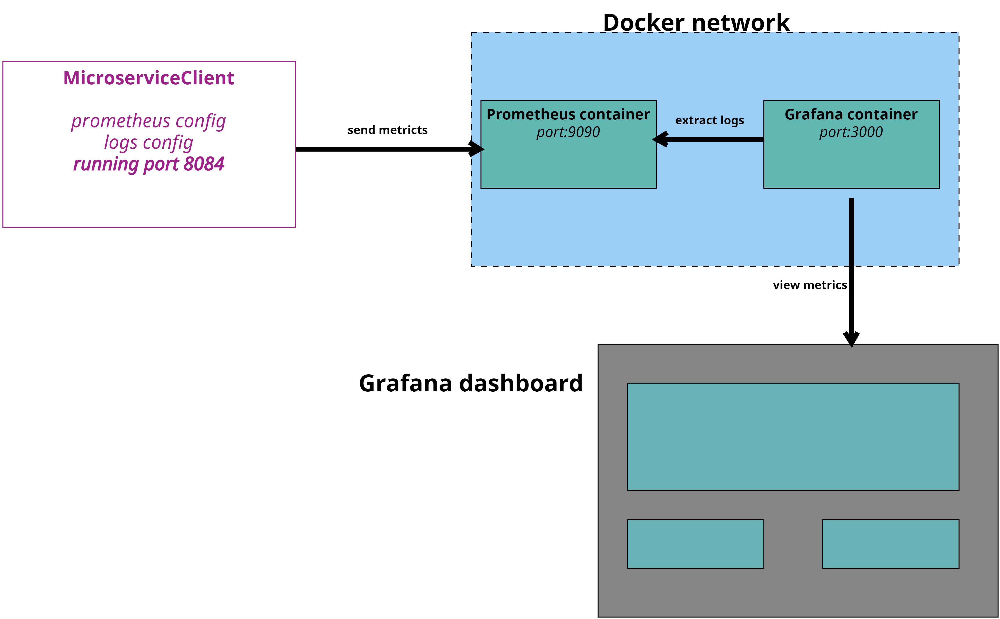


## Instrucciones
Este laboratorio esta dividido en las siguientes secciones: 

- **[Configuración prometheus y grafana](#configuración-prometheus-y-grafana-instrucciones)**

- **[Configuración MicroserviceClient](#configuración-microserviceclient-instrucciones)**

- **[Crear dashboard en Grafana](#crear-dashboard-en-grafana-instrucciones)**

## Configuración prometheus y grafana [instrucciones](#instrucciones)

> **IMPORTANTE**: Antes de comenzar es necesario validar que tengamos instalado **docker compose** válidar con el siguiente comando: **docker-compose --version**, si no lo tenemos instalado seguir las siguientes instrucciones [docker-compose](https://docs.docker.com/compose/install/)

1. En el escritorio de nuestra máquina crear un archivo que llamaremos
**prometheus.yaml**

2. Añadir el siguiente contenido al archivo **prometheus.yaml**

```yaml
scrape_configs:
  - job_name: 'spring-boot-application'
    metrics_path: '/actuator/prometheus'
    scrape_interval: 10s
    static_configs:
      - targets: ['host.docker.internal:8084']
```

> **NOTA**: Esta configuración registra en prometheus el endpoint
del microservicio cliente 

3. Obtener la ruta absoluta del archivo **prometheus.yaml**, la necesitaremos más adelante

    **La ruta debería verse algo así:**
    ```bash
    C:\Users\egar2\Escritorio\prometheus.yaml
    ```
4. En el mismo escritorio crearemos otro archivo que llamaremos **docker-compose.yaml**

> **IMPORTANTE**: Asegurate que el nombre si sea **docker-compose.yaml** ya que si no indicas el nombre correctamente el comando que usaremos más adelante fallará. 

5. Dentro del archivo **docker-compose.yaml** añadir el siguiente contenido:

**docker-compose.yaml**
```yaml
services:
  prometheus:
    container_name: prometheus
    image: 'prom/prometheus:latest'
    volumes:
      - '<pegar_ruta_prometheus.yaml>:/etc/prometheus/prometheus.yml'
    ports:
      - 9090:9090
  
  grafana:
    container_name: grafana
    image: 'grafana/grafana-oss:latest'
    environment:
      - GF_SECURITY_ADMIN_PASSWORD=pass
    ports:
      - 3000:3000
```

> **IMPORTANTE:**: Antes de pasar al siguiente paso asegurate que has sustituido en la sección **volumes** la ruta de tu archivo **prometheus.yaml**. 

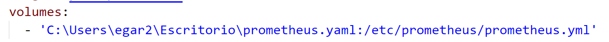

6. Abrir una terminal en el escritorio

7. Ejecutar el siguiente comando:

    ```bash
    docker-compose up -d
    ```

    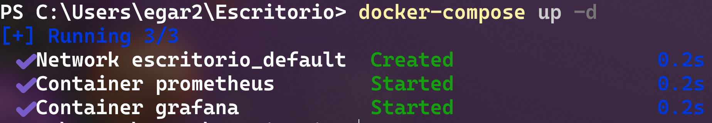


9. Abrir 2 exploradores web y abrir los siguientes enlaces

    - **Prometheus**: http://localhost:9090

        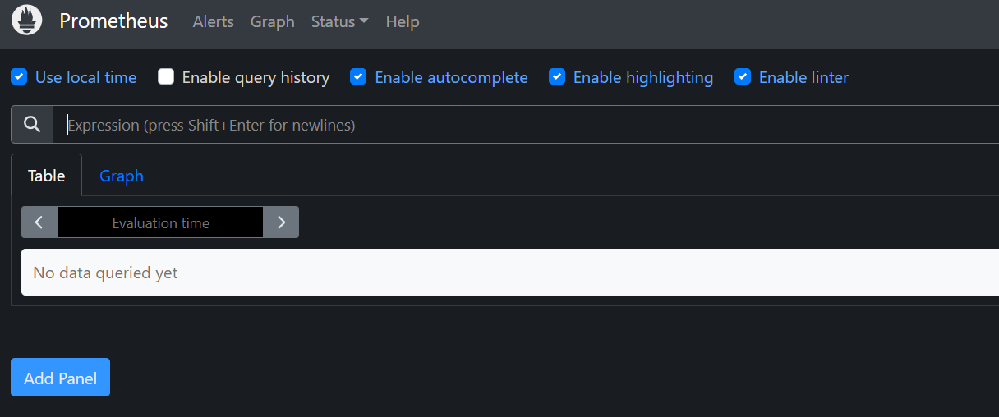

    - **Grafana**: http://localhost:3000
        - **username grafana**: admin
        - **password grafana**: pass

        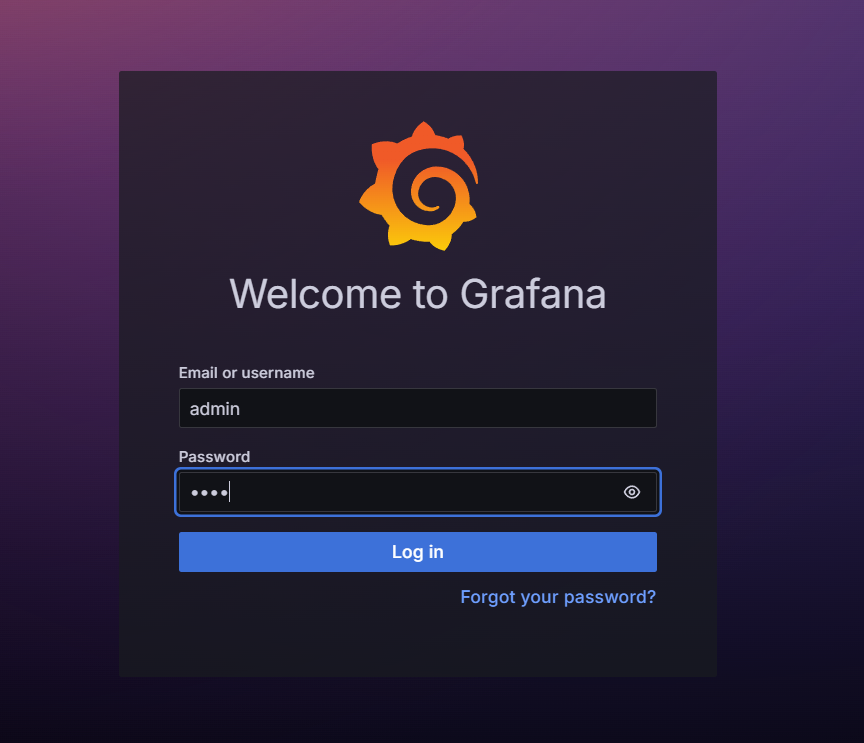

10. Conectar prometheus con grafana
    - **MENU**->**Connections**-> **Add new connection**

    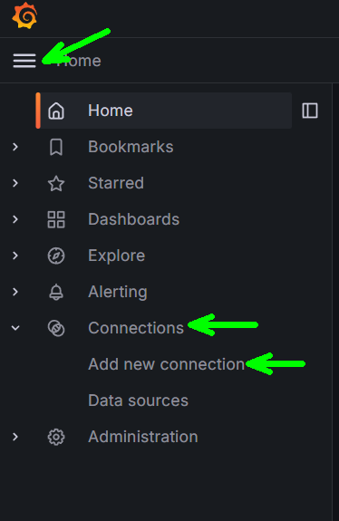

11. Buscar **Prometheus** 

    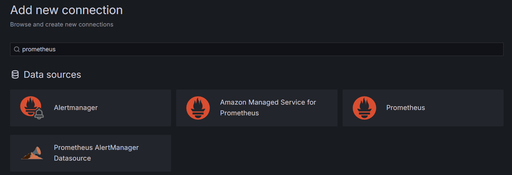

12. Seleccionar **Add new data source**

    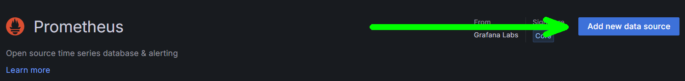

13. En **prometheus connection** escribir **http://prometheus:9090** y guardar conexión: 

    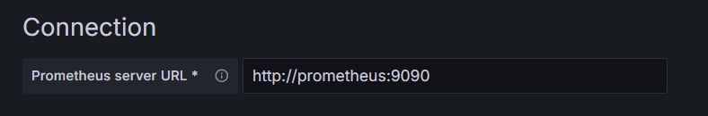


## Configuración MicroserviceClient [instrucciones](#instrucciones)

> **IMPORTANTE**: Antes de comenzar usaremos el microservicio que usamos en el **capítulo 3** en el caso que no lo tengas lo podrás encontrar en la carpeta **[Capitulo9](../Capitulo9/)**

1. Abrir **MicroserviceClient** en **Spring Tool Suite**
2. Sustituir el código del archivo **MicroserviceClient**->**src/main/java**->**com.bancolombia.app.controller**->**MicroController.java** con el siguiente contenido:

    **MicroController.java**
    ```java
    package com.bancolombia.app.controller;

    import java.util.List;
    import java.util.NoSuchElementException;

    import org.slf4j.Logger;
    import org.slf4j.LoggerFactory;
    import org.springframework.beans.factory.annotation.Autowired;
    import org.springframework.http.HttpStatus;
    import org.springframework.http.ResponseEntity;
    import org.springframework.web.bind.annotation.DeleteMapping;
    import org.springframework.web.bind.annotation.GetMapping;
    import org.springframework.web.bind.annotation.PathVariable;
    import org.springframework.web.bind.annotation.PostMapping;
    import org.springframework.web.bind.annotation.PutMapping;
    import org.springframework.web.bind.annotation.RequestBody;
    import org.springframework.web.bind.annotation.RequestMapping;
    import org.springframework.web.bind.annotation.RestController;

    import com.bancolombia.app.entities.Client;
    import com.bancolombia.app.services.IService;

    @RestController
    @RequestMapping("/client")
    public class MicroController {
	
    	private final Logger LOGGER=LoggerFactory.getLogger(MicroController.class);
	
        @Autowired
        private IService service;
        
        
        @PostMapping
        public ResponseEntity<String> insert(@RequestBody Client client){
            try {
                if(service.insert(client)) {
                    LOGGER.info("OK INSERT {}",client.getEmail());
                    return new ResponseEntity<String>("insertado", HttpStatus.CREATED);
                }
                LOGGER.warn("BAD REQUEST INSERT {}", client.getEmail());
                return new ResponseEntity<String>("no insertado", HttpStatus.BAD_REQUEST);
            }catch(Exception ex) {
                LOGGER.error("ERROR INSERT {}", ex.getMessage());
                return new ResponseEntity<String>(ex.getMessage(), HttpStatus.INTERNAL_SERVER_ERROR);
            }
            
        }
        
        
        @GetMapping("/{id}")
        public ResponseEntity<Client> findById(@PathVariable("id") long id){
            try {
                
                return new ResponseEntity<Client>(service.findById(id), HttpStatus.OK);
                
                
            }catch(NoSuchElementException ex) {
                LOGGER.warn("404 FINDBYID {}",id);
            return new ResponseEntity<Client>(HttpStatus.NOT_FOUND);
            }catch(Exception ex) {
                LOGGER.error("ERROR FINDBYID {}", ex.getMessage());
                return new ResponseEntity<Client>(HttpStatus.INTERNAL_SERVER_ERROR);
            }
        } 
        
        @DeleteMapping("/{id}")
        public ResponseEntity<String> deleteById(@PathVariable("id") long id){
            try {
                if(service.deleteById(id)) {
                    LOGGER.info("OK DELETE {}", id);
                    return new ResponseEntity<String>("eliminado", HttpStatus.OK);
                }
                LOGGER.warn("404 DELETE {}",id);
                return new ResponseEntity<String>("no existe", HttpStatus.NOT_FOUND);
                
            }catch(Exception ex) {
                LOGGER.error("ERROR DELETE {}",id);
                return new ResponseEntity<String>("error servidor", 
                        HttpStatus.INTERNAL_SERVER_ERROR);
            }
        }
        
        @PutMapping
        public ResponseEntity<String> update(@RequestBody Client client){
            try {
                if(service.update(client)) {
                    LOGGER.info("OK UPDATE {}", client.getId());
                    return new ResponseEntity<String>("actualizado",HttpStatus.OK);
                }
                
                LOGGER.warn("404 UPDATE {}",client.getId());
                return new ResponseEntity<String>("no existe", HttpStatus.NOT_FOUND);
                
            }catch(Exception ex) {
                LOGGER.error("ERROR UPDATE {}",ex.getMessage());
                return new ResponseEntity<String>(ex.getMessage(), HttpStatus.INTERNAL_SERVER_ERROR);
                
            }
            
        }
        
        @GetMapping
        public ResponseEntity<List<Client>> getAll(){
            return new ResponseEntity<List<Client>>(service.getAll(), HttpStatus.OK);
        }
        
    }

    ```

3. En el archivo **pom.xml** añadiremos las siguientes dependencias en la sección **< dependencies >**

    ```xml
    <!--Spring Boot Actuator dependency-->
    <dependency>
        <groupId>org.springframework.boot</groupId>
        <artifactId>spring-boot-starter-actuator</artifactId>
    </dependency>

    <!--Prometheus dependency-->
    <dependency>
        <groupId>io.micrometer</groupId>
        <artifactId>micrometer-registry-prometheus</artifactId>
                <scope>runtime</scope>
    </dependency>
    ```

4. En el archivo **application.properties** añadir las siguientes configuración al final del archivo. 

> **IMPORTANTE**: No borres la configuración existente del archivo **application.properties**, porque puede dejar de funcionar el microservicio.

```properties
management.endpoints.web.exposure.include=prometheus
management.endpoint.prometheus.enabled=true
```
**application.properties completo**
```properties
spring.application.name=micro-client
server.port=8084

#hibernate configuration
spring.jpa.properties.hibernate.dialect=org.hibernate.dialect.MySQLDialect
spring.jpa.hibernate.ddl-auto=update

#datasource
spring.datasource.url=jdbc:mysql://localhost:3306/micro1
spring.datasource.username=root
spring.datasource.password=1234

#prometheus config
management.endpoints.web.exposure.include=prometheus
management.endpoint.prometheus.enabled=true
```

5. Iniciar **MicroserviceClient**

6. Abrir un explorador web y abrir el siguiente enlace: http://localhost:8084/actuator/prometheus, si la configuración fue correcta deberías de observar lo siguiente:

    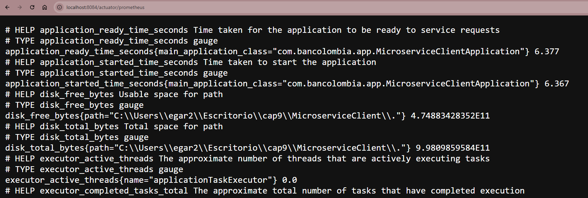

## Crear dashboard en Grafana [instrucciones](#instrucciones)

1. Abrir un nuevo explorador y abrir el siguiente enlace: http://localhost:3000 e iniciar sesión:
    - **username**: admin
    - **password**: pass

    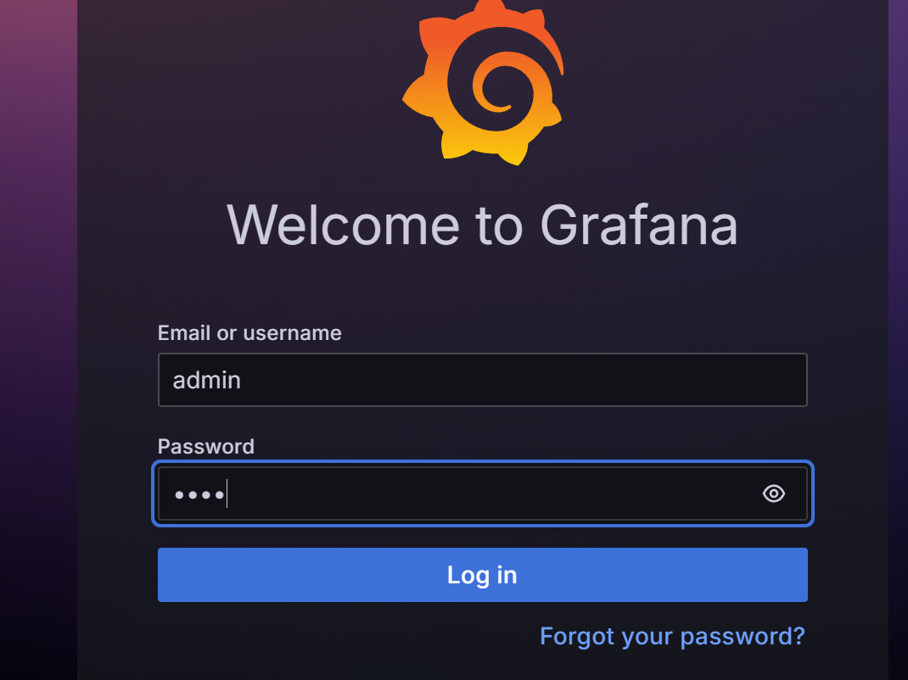

2. Abrir **Menu**->**Dashboards**

    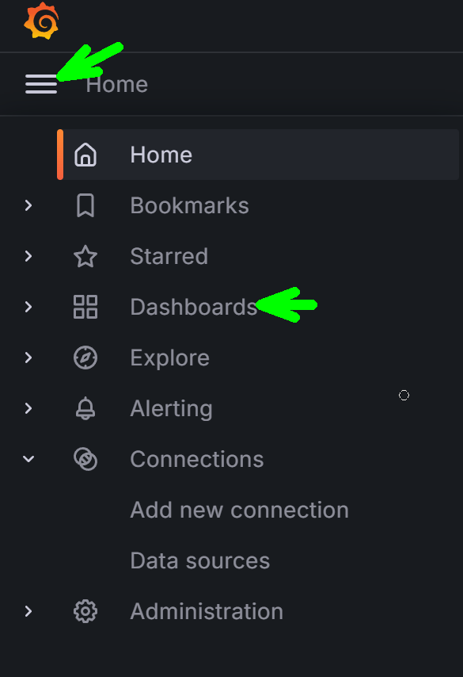

3. **New**->**new dashboard**

    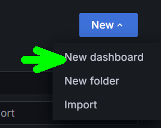

4. **Add visualization**

    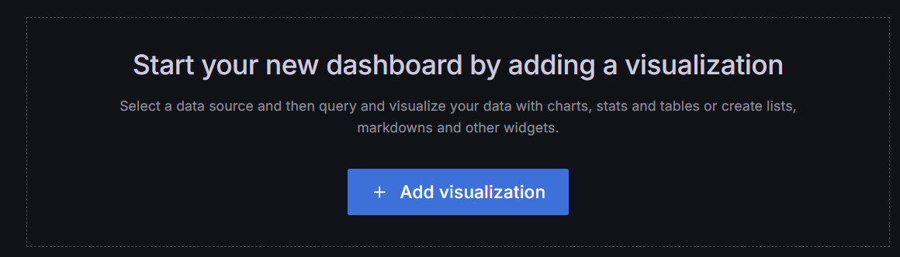

5. Selecciona cómo **datasource** a **Prometheus**

6. En la sección de queries realiza la siguiente configuración:

    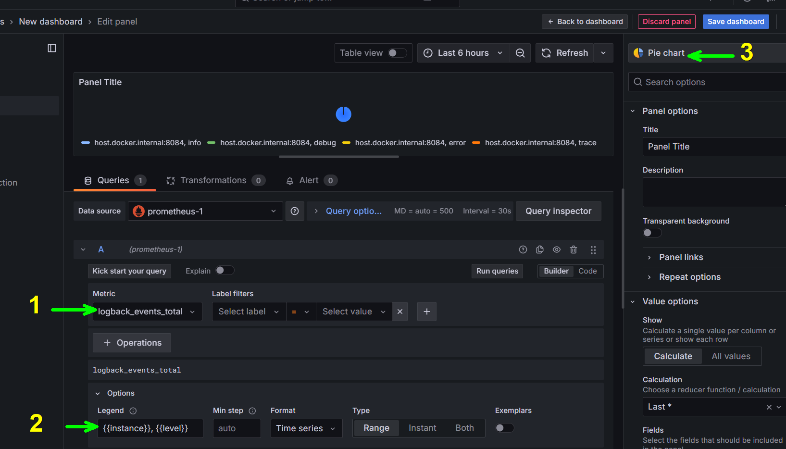

    1. **Metric**: logback_events_total
    2. **Options**: {{instance}}, {{level}}
    3. **Pie chart**: tipo de gráfico que usaremos para mostrar al cliente.

7. Salvar dashboard **Save dashboard**


## Resultado esperado
Si has llegado hasta aquí tu dashboard de grafana debió haber quedado de la siguiente forma: 

1. Usar el microservicio cliente desde **Insomnia** para generar más logs y registrarlos en el dashboard.


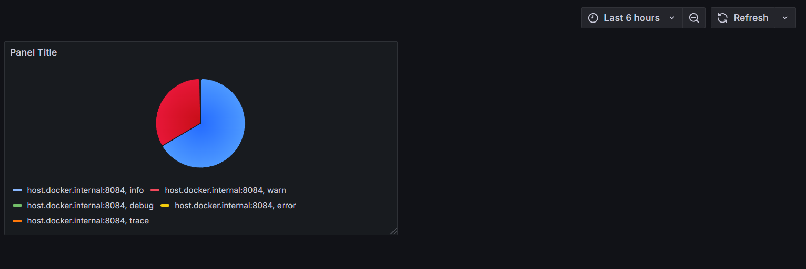

