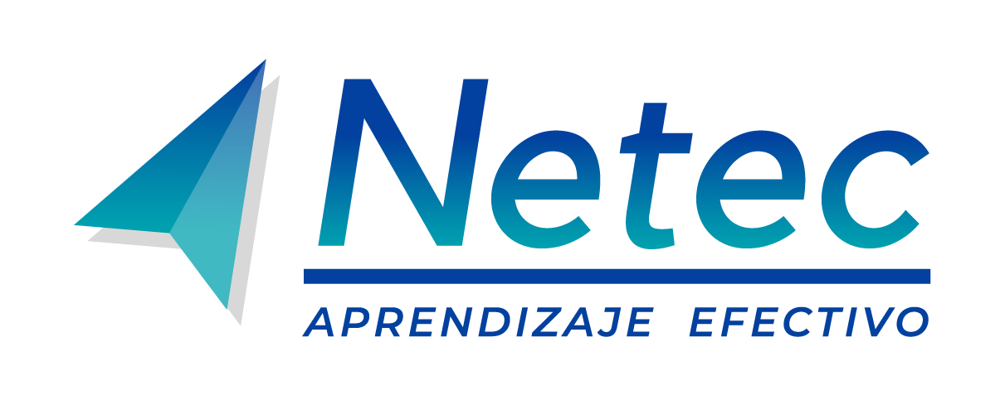

<table>
  <tbody>
      <tr>
    <td> 
        
    <td>
    <td>
      <h1>Microservicios con Spring Cloud Essentials<h1>
    </td>
  </tr>
  </tbody>
<table>

**Plataforma de Laboratorios**
Bienvenido a la **Plataforma de Laboratorios** del curso **Microservicios con Spring Cloud Essentials**. Aquí podrás explorar diferentes tecnologías a través de prácticas guiadas. ¡Desarrolla tus habilidades y lleva tus conocimientos al siguiente nivel!

# Lista de Laboratorios
Cada uno de estos laboratorios está diseñado para ofrecerte una experiencia práctica. Haz clic en los enlaces para comenzar.

01. ### [Sistema Monolítico Net Core 8](./Capitulo1/README.md)
    - **Descripción**: Despliegue y análisis de una aplicación monolítica en **.net core 8**
    - ⏱️ **Duración estimada**: 45 min

02. ### [Servicio de descubrimiento con microservicios](./Capitulo2/README.md)
    - **Descripción**: Implementación del servidor Eureka para el registro de microservicios.
    - ⏱️ **Duración estimada**: 45 min

03. ### [Diseño de microservicio con Spring Boot](./Capitulo3/README.md)
    - **Descripción**: Desarrollo de un microservicio usando Spring Boot 
    - ⏱️**Duración estimada**: 60 min

04. ### [Implementando comunicación Http para los microservicios](./Capitulo4/README.md)
    - **Descripción**: Implementar comunicación entre microservicios usando **Spring Cloud Open Feign**
    - ⏱️**Duración estimada**: 60 min
05. ### [Aislando Configuración de Microservicios con Spring Cloud Config](./Capitulo5/README.md)
    - **Descripción**: Implementar servidor de configuración para externalizar la configuración de microservicios
    - ⏱️**Duración estimada**: 45 min

06. ### [Asegurando microservicios con Autenticación JWT](./Capitulo6/README.md)
    - **Descripción**: Asegurar un microservicios de Spring Cloud usando **OpenID connect**
    - ⏱️**Duración estimada**: 60 min

07. ### [CI/CD Github Actions](./Capitulo7/README.md)
    - **Descripción**: Implementar un pipeline de integración continua usando **Github Actions**
    - ⏱️**Duración estimada**: 60 min

08. ### [Despliegue de microservicios con Kubernetes Local](./Capitulo8/README.md)
    - **Descripción**: Desplegar microservicios usando kubernetes
    - ⏱️**Duración estimada**: 60 min

09. ### [Monitoreo de Microservicios con Prometheus y Grafana](./Capitulo9/README.md)
    - **Descripción**: Implementar Prometheus y grafana para el monitoreo de un microservicio de Spring Cloud.
    - ⏱️**Duración estimada**: 60 min

- ### [Microfrontend con Angular 18](./Capitulo10/README.md)
    - **Descripción**: Implementar un microfrontend para comprender el nuevo mundo de los microservicios.
    - ⏱️**Duración estimada**: 60 min

- ### [Proyecto final](./Capitulo11/README.md)
    - **Descripción**: Desarrollar un proyecto pequeño de microservicios donde se apliquen los conocimientos adquiridos a lo largo del curso. 

    - ⏱️**Duración estimada**: 240 min

---
## 📬 **Contacto y Más Información**

Si tienes alguna pregunta o necesitas más detalles, no dudes en [contactarnos](mailto:soporte@netec.com). También puedes encontrar más recursos en nuestra [página de recursos](https://netec.com).

---

¡Gracias por visitar nuestra plataforma! No olvides revisar todos los laboratorios y comenzar tu viaje de aprendizaje hoy mismo.
